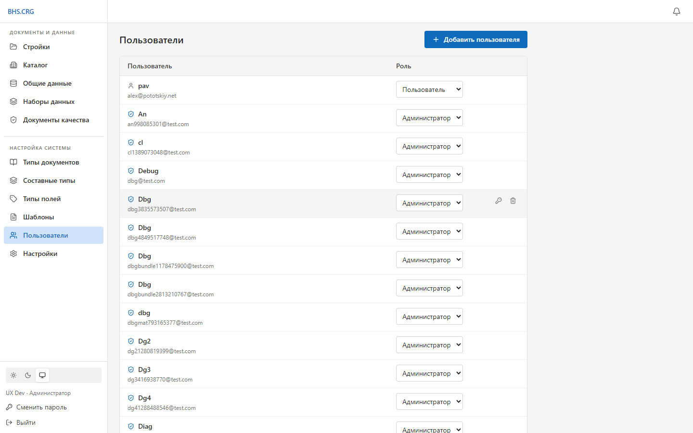
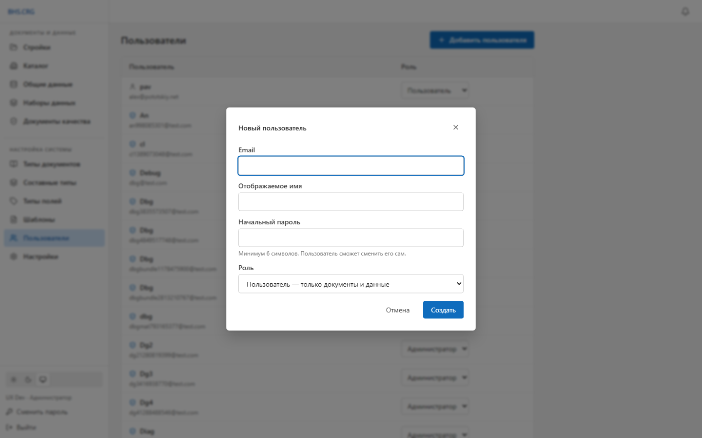
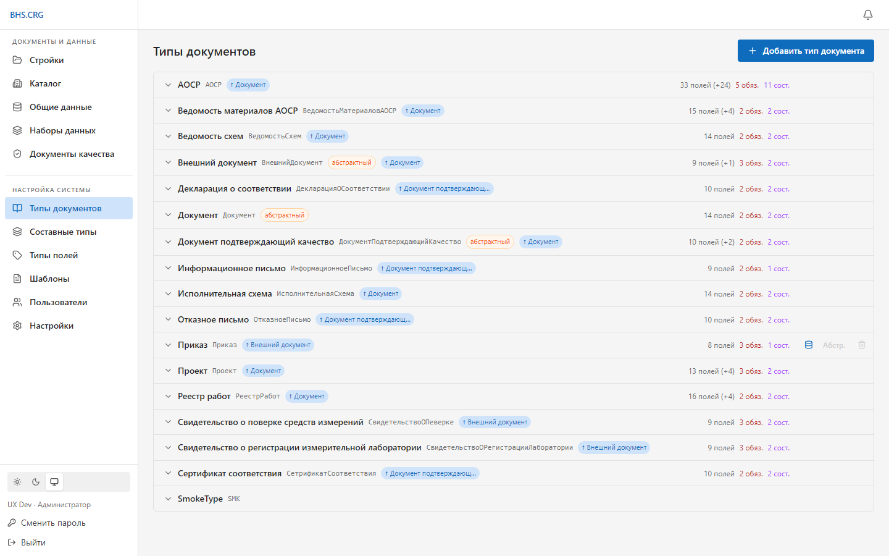
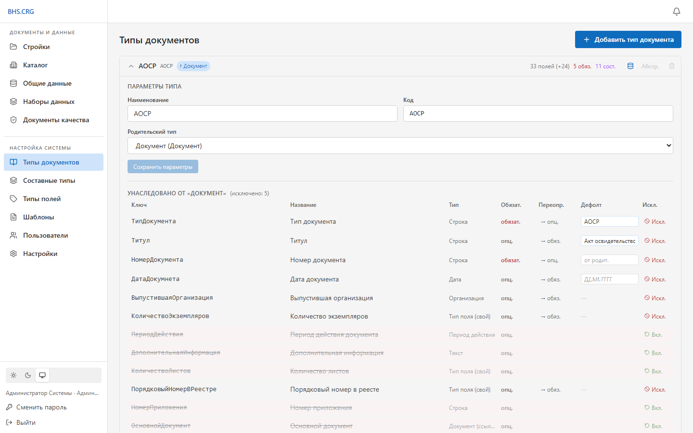
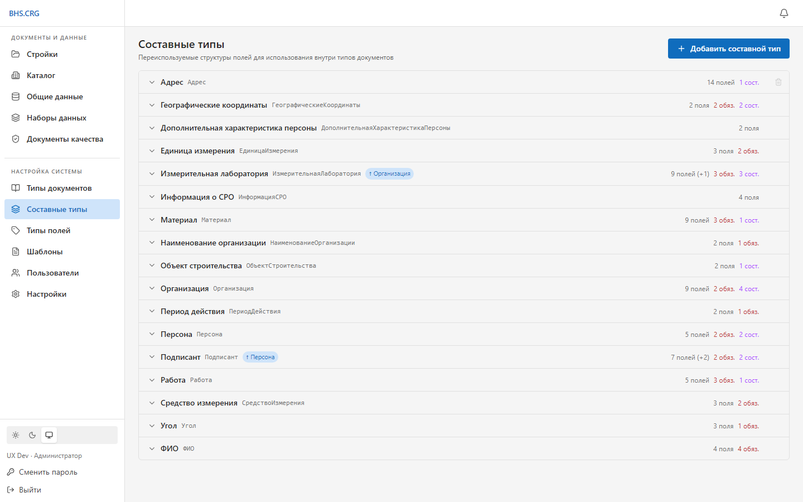
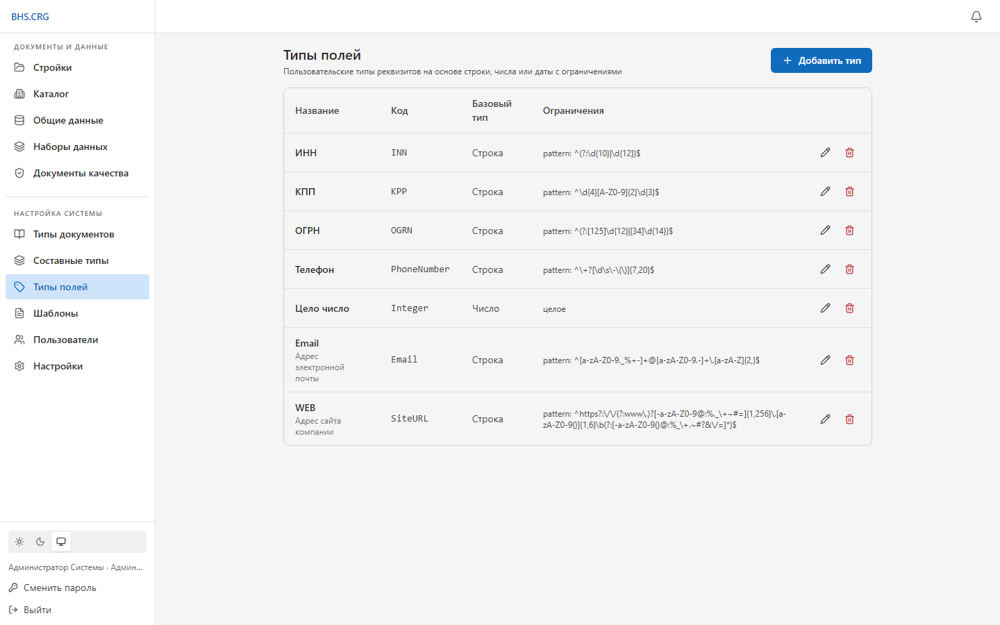
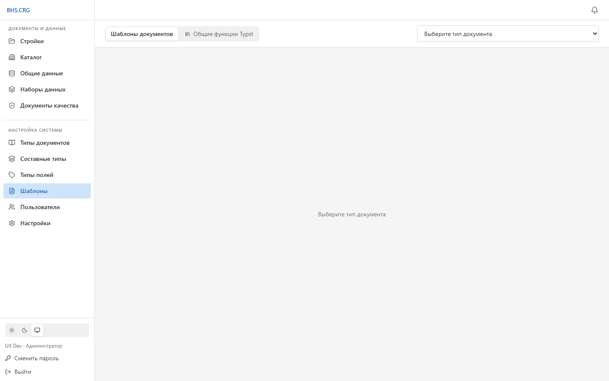
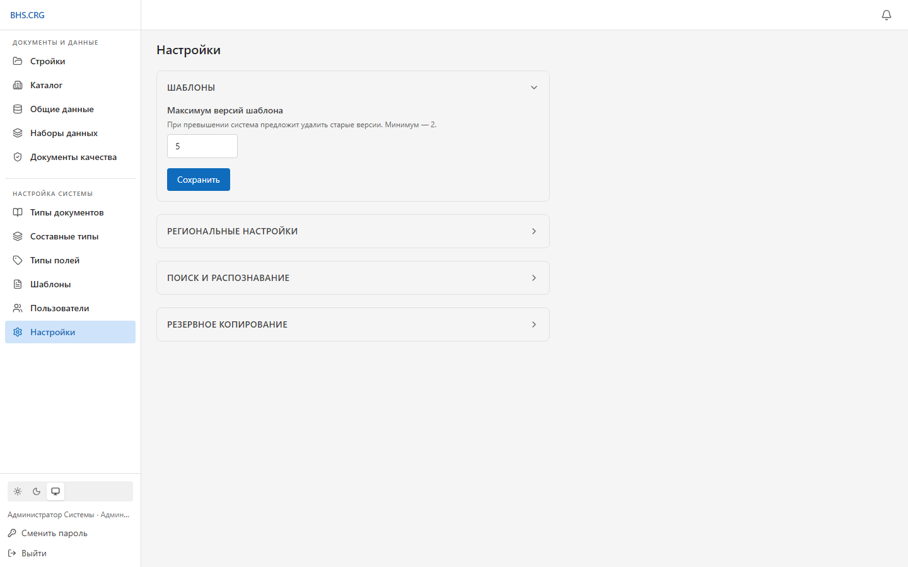
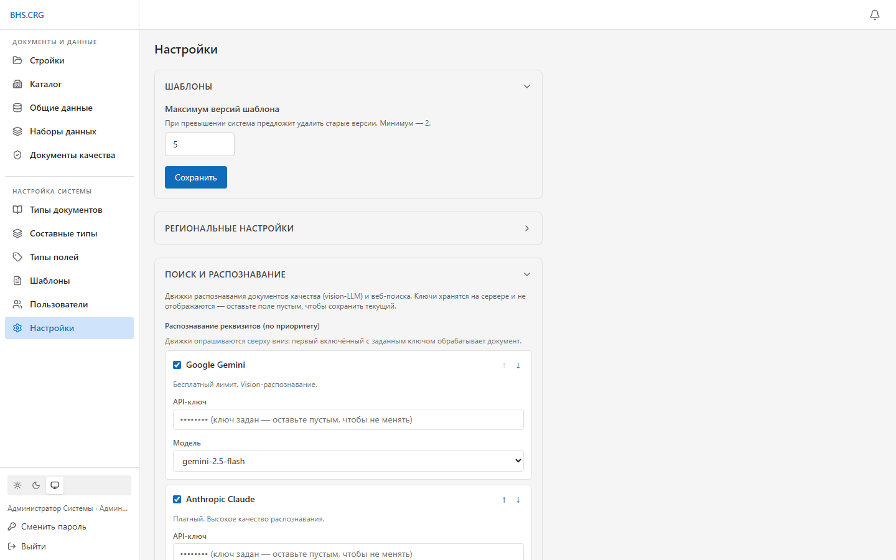

# Инструкция администратора BHS.CRG

Администратор имеет **полный доступ**: всё, что доступно пользователю (работа с
документами и данными), **плюс** раздел **«Настройка системы»** — типы документов,
составные типы, типы полей, шаблоны, пользователи и настройки.

> Базовые операции с документами описаны в «Инструкции пользователя». Здесь —
> только администрирование.

---

## 1. Роли и доступ

В системе две роли:

| Роль | Доступ |
|---|---|
| **Администратор** | Полный доступ, включая «Настройку системы» и пользователей |
| **Пользователь** | Только «Документы и данные» |

Разделы «Настройка системы» видны и доступны только администратору — и в интерфейсе,
и на уровне API (изменение конфигурации защищено ролью).

> **Первый администратор** создаётся при первом запуске системы через регистрацию
> (см. «Инструкцию по развёртыванию»). После этого публичная регистрация закрывается,
> и все учётные записи заводит администратор.

---

## 2. Управление пользователями

Раздел **Настройка системы → Пользователи**.

Возможности:
- **Добавить пользователя** — email, отображаемое имя, начальный пароль и роль.

  

- **Смена роли** — выпадающий список в строке (Администратор / Пользователь).
- **Сброс пароля** — иконка с ключом: задать пользователю новый пароль (сообщите ему).
- **Удаление** — иконка корзины.

Встроенные защиты (система не позволит «закрыть» себе доступ):
- нельзя удалить **самого себя**;
- нельзя понизить/удалить **последнего администратора**.

> Каждый пользователь может сам сменить свой пароль (кнопка **«Сменить пароль»** внизу
> панели). Сброс чужого пароля — только у администратора.

---

## 3. Типы документов

Раздел **Настройка системы → Типы документов**. Тип документа описывает **схему полей**
(реквизитов) и поведение при генерации.

В строке типа отображаются: код, родительский тип (наследование), число полей,
обязательных и составных. По наведению — действия: **шаблоны данных**, переключатель
**«Абстрактный»**, удаление.

### 3.1. Наследование и абстрактные типы
Типы образуют иерархию: дочерний тип **наследует поля** родителя. **Абстрактный** тип
нельзя добавить в комплект напрямую — он служит основой для других (например, общий тип
«Документ»).

### 3.2. Редактор схемы
Щёлкните по типу, чтобы раскрыть редактор.

Разделы редактора:
- **Параметры типа** — наименование, код, родительский тип.
- **Унаследовано от «…»** — поля родителя; для каждого можно:
  - **исключить** (Искл.) — убрать поле из этого типа;
  - **переопределить обязательность** (→ обяз./→ опц.);
  - задать **значение по умолчанию**.
- **Собственные поля** — конструктор полей: ключ, название, тип, обязательность,
  значение по умолчанию и **функциональные тэги** (см. раздел 8).
- **Группировка полей** — объединение реквизитов в группы (для удобного заполнения).
- **Функциональные тэги типа** — пометки на уровне типа (например, «документ качества»).
- **Typst‑блоки** — варианты отображения при генерации PDF.

После изменений нажмите **«Сохранить схему»**. Также доступен просмотр схемы в виде **JSON**.

> **Шаблоны данных** (иконка БД в строке типа) — переиспользуемые правила привязки
> наборов данных к полям этого типа.

---

## 4. Составные типы

Раздел **Настройка системы → Составные типы**. Это переиспользуемые структуры полей,
которые вставляются внутрь типов документов (например, «Организация», «Подписант»,
«Период действия»).

Редактируются так же, как типы документов (поля, группы, тэги).

---

## 5. Типы полей

Раздел **Настройка системы → Типы полей**. Пользовательские типы реквизитов на основе
строки, числа или даты — с ограничениями (формат, диапазон, шаблон) и допустимыми
функциональными тэгами.

Такой тип затем выбирается для поля в схеме документа и обеспечивает единообразную
проверку ввода.

---

## 6. Шаблоны

Раздел **Настройка системы → Шаблоны**. Здесь настраивается оформление документов при
генерации PDF (на основе Typst), параметры страницы и т. п.

> Количество хранимых версий шаблона ограничивается настройкой (см. раздел 7).

---

## 7. Настройки

Раздел **Настройка системы → Настройки** — сгруппированные параметры.

| Группа | Назначение |
|---|---|
| **Шаблоны** | Максимум хранимых версий шаблона |
| **Региональные настройки** | Локаль (формат дат, чисел) |
| **Поиск и распознавание** | Провайдеры распознавания и веб‑поиска, ключи, домены |
| **Резервное копирование** | Создание резервных копий |

### Поиск и распознавание
Раскрыв группу, можно настроить распознавание реквизитов сканов (Ollama / Claude / Gemini),
веб‑поиск документов качества (Serper / Yandex), а также списки доменов ФГИС и
производителей.

> Ключи API хранятся в БД и **маскируются при чтении** (показывается только признак
> «ключ задан»). Пустое значение при сохранении не затирает ранее заданный ключ.
> Часть значений можно также задать через переменные окружения при развёртывании.

> **⚠ Точность распознавания ГОСТ-штампа (реализовано не полностью для Ollama).**
> Для распознавания основной надписи по ГОСТ система извлекает точный текст штампа из PDF
> (текстовый слой/аннотации) и передаёт его модели как «опору» (grounding), чтобы шифр и
> наименование не искажались OCR. Облачные движки (**Claude / Gemini**) эту опору соблюдают
> надёжно; **офлайн-Ollama** (qwen2.5vl) соблюдает её **хуже** и может вернуть «исправленный»
> по картинке шифр/наименование. **Для распознавания проектной документации рекомендуется
> облачный движок**; на Ollama результат может требовать ручной проверки/корректировки разбиения.
> Детерминированный override извлечённого текста поверх ответа модели — в планах, пока не реализован.

---

## 8. Функциональные тэги (как это работает)

Связь между **пользовательской схемой** и **встроенной логикой** реализована через
**функциональные тэги**, а не через имена полей. Примеры: тэг «номер документа», «срок
действия», «производитель», «идентичность материала», «ссылка на документ качества»,
тип «документ качества».

Практический смысл для администратора:
- помечайте поля/типы нужными тэгами в редакторе схемы — и встроенный функционал
  (генерация метаданных, привязка документов качества, распознавание и т. д.) начнёт их
  использовать **независимо от того, как названо поле**;
- не полагайтесь на «магические» имена полей — используйте тэги.

---

## 9. Рекомендации и безопасность

- Выдавайте роль **Администратор** только тем, кому действительно нужна настройка системы;
  остальным — **Пользователь**.
- Удалите лишние тестовые учётные записи.
- Храните хотя бы **двух администраторов** (на случай утери доступа одним).
- Регулярно делайте **резервные копии** (раздел 7 и средства развёртывания).
- Ключи интеграций задавайте в настройках или переменных окружения; не передавайте их
  в открытом виде.
