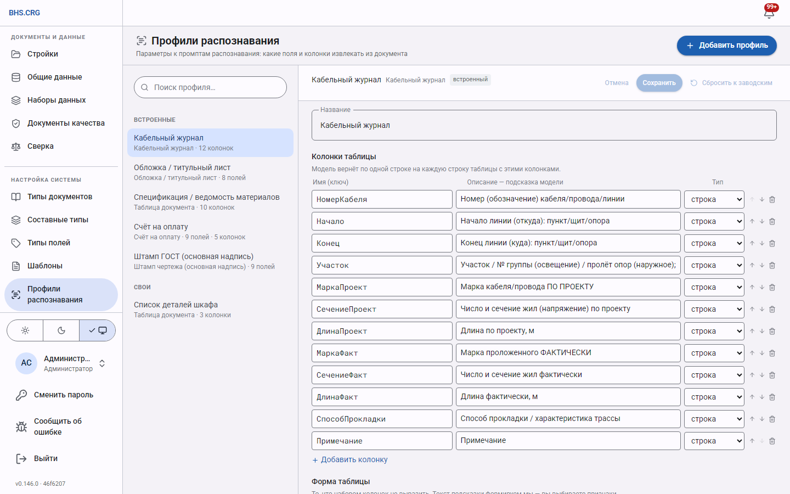
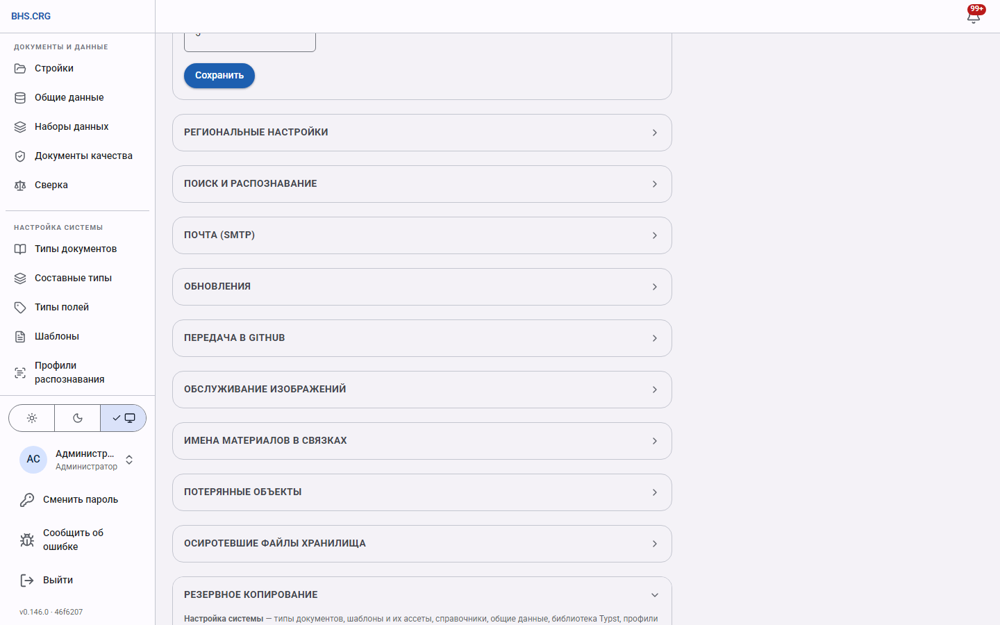
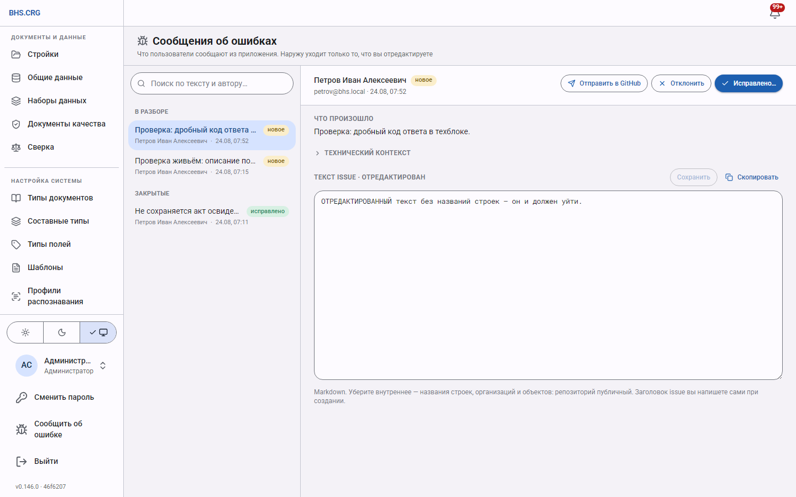

# Инструкция администратора BHS.CRG

Администратор имеет **полный доступ**: всё, что доступно пользователю (работа с
документами и данными), **плюс** раздел **«Настройка системы»** — типы документов,
составные типы, типы полей, шаблоны, профили распознавания, пользователи и настройки.

> Базовые операции с документами описаны в «Инструкции пользователя». Здесь —
> только администрирование.

---

## 1. Роли и доступ

**Доступ выдаётся правами, а не ролью.** Роль — это набор прав и ничего больше: её можно
переименовать, изменить её состав или завести свою, и система будет пускать по составу, а не по
названию. Каждая дверь — и экран, и адрес API — закрыта конкретным правом.

При установке заводится девять ролей: «Администратор» и восемь рабочих — «Инженер ИД», «Монтажник»,
«Менеджер проекта», «Сметчик», «Руководитель», «Снабженец», «Бухгалтер», «Производитель работ».
Это стартовый набор, а не закрытый перечень: состав любой из них правится, и рядом заводятся свои.
Что даёт каждое право и как его выдать — §2.1.

У «Администратора» состав прав не перечислен: он **равен всему справочнику прав** и пополняется
вместе с ним, поэтому право, появившееся с обновлением или с новым модулем, достаётся ему само.
По той же причине его состав не правится — нужен администратор с ограничениями, заведите отдельную
роль (§2.1).

> **Первый администратор** заводится на экране **«Первый вход»** — он открывается вместо формы
> входа, пока в системе нет ни одного пользователя (см. «Инструкцию по развёртыванию», §5).
> Сразу после создания учётной записи система входит под ней, а публичная регистрация
> закрывается: дальше все учётные записи заводит администратор.

---

## 2. Управление пользователями

Раздел **Настройка системы → Пользователи**.


Возможности:
- **Добавить пользователя** — email, отображаемое имя, начальный пароль и роли.

  

- **Смена ролей** — меню с галками в строке: ролей у человека может быть **несколько**, и
  действующие права — объединение прав всех его ролей.
- **Сброс пароля** — иконка с ключом: задать пользователю новый пароль (сообщите ему).
- **Удаление** — иконка корзины.

Встроенные защиты (система не позволит «закрыть» себе доступ):
- нельзя удалить **самого себя**;
- нельзя снять **с себя** право «заводить пользователей, назначать им роли…»: вернуть его было бы
  некому;
- нельзя оставить систему **без единого человека с этим правом** — ни сменой ролей, ни удалением.

> Обе последние защиты считаются **по праву, а не по названию роли**. Если вы завели свою роль и
> дали ей право управлять пользователями, её носитель считается управляющим наравне с
> «Администратором» — и, наоборот, снятие «Администратора» у того, у кого остаётся другая роль
> с этим правом, пройдёт без возражений.

> Свои данные пользователь правит сам — на странице **«Профиль»** (пилюля с именем внизу панели):
> фото, отображаемое имя, смена пароля и смена email с подтверждением по письму.
>
> **Забытый пароль тоже сбрасывается без вас** — ссылкой «Забыли пароль?» на экране входа, если
> настроена почта (§8). Ваш сброс из этого раздела остаётся для случаев, когда почты нет или
> письмо не доходит.

### 2.1. Роли и права

Раздел **Настройка системы → Роли и права** (право «заводить пользователей, назначать им роли,
менять состав прав роли»).

**Роль — это набор прав, а не должность.** Права выдаются галками, права сгруппированы по модулям, и
у каждой галки написано, **что право даёт** и **к каким данным открывает доступ**. Это не
документация, а условие безопасности: галка с подписью `costs.invoice.approve` не даёт ни одного
основания решить, ставить её или нет.

Что можно:

- **Завести роль** — кнопка «Новая роль». Роль создаётся пустой, права ставятся тут же, рядом с
  объяснениями.
- **Изменить состав прав** любой роли, включая системные.
- **Переименовать** и **удалить** — только роли, заведённые вами. Роль, которую кто-то носит,
  удалить нельзя: это забрало бы доступ у всех разом и без следа, у кого именно. Сначала снимите её
  на экране «Пользователи».

Чего нельзя и почему:

| Запрет | Почему |
|---|---|
| Удалить системную роль | Она создаётся при установке и вернётся при следующем запуске |
| Переименовать системную роль | Название задано кодом и возвращается при каждом запуске — правка отменилась бы сама |
| Править состав роли «Администратор» | У неё состав не перечислен: он **равен справочнику прав** и пополняется вместе с ним. Заморозь его — и право следующего обновления не досталось бы никому. Нужен администратор с ограничениями — заведите отдельную роль |

**Правка действует немедленно.** Сняли право — носители роли теряют доступ на следующем же
запросе, перезаходить в систему никому не нужно. Каждое изменение состава попадает в журнал
действий (§2.2) вместе с тем, что было до.

> ⚠️ **Одна галка шире, чем звучит: «вести сверки целиком».** Правило сверки пишет сам обладатель
> права — он выбирает любые наборы данных, а находки показывают сравниваемые значения. То есть
> право открывает данные **поверх** прав на модули, а не в их пределах. Той же галкой приходят
> замечания внешнего анализа по всем стройкам (вместе с удалением) и выгрузка отчёта о расхождениях
> по любому комплекту. Выдавать её «чтобы посмотреть расхождения» нельзя. Отдельное право на правку
> определения рассматривалось и намеренно не введено: сверки ведут те же люди, что их настраивают.

> **Роли выдаются на экране «Пользователи»**, меню с галками в строке. Там же видно, кто какие роли
> носит сейчас.
>
> **Ролей может быть несколько**, и права складываются: сметчик, который ещё и снабженец, получает
> обе роли, а не выбор между ними. Ролей столько, сколько нужно; отрицательных прав («запретить,
> несмотря на роль») в системе нет — сузить доступ можно, сняв роль.
>
> ⚠️ **Снятые все роли — это отозванный доступ, а не «роль по умолчанию».** Человек сможет войти,
> но не увидит ничего. Так доступ отзывают, не удаляя учётную запись: её след в журнале действий
> при этом сохраняется. Завести же человека совсем без ролей нельзя — такая учётная запись
> выглядела бы поломкой, а не решением.

### 2.2. Журнал действий

Раздел **Настройка системы → Журнал действий** (право «читать журнал действий»).

Журнал отвечает на вопрос, который задают уже после того, как что-то пошло не так: **кто выдал
это право**, **когда у типа пропало поле**, **что было до**. По самим данным на него ответить
нельзя — они показывают нынешнее состояние и не помнят, как до него дошли.

Что попадает в журнал:

| Событие | Что видно |
|---|---|
| Заведён пользователь | автор, почта заведённого, выданная роль |
| Изменена роль пользователя | автор, почта, **прежняя роль** и новая |
| Удалён пользователь | автор, почта, роль, которая была |
| Изменена схема типа | автор, название типа, состав полей до правки и что добавлено/убрано |
| Изменён состав модулей | прежний набор и новый (замечается при запуске системы) |

Колонка «Было → стало» — главная: прежнее значение и есть то, ради чего в журнал заглядывают.

**Первый администратор тоже записан** — той же строкой «Заведён пользователь», но автором у неё
значится **Система**. Так и есть: его заводят через страницу регистрации при установке, когда в
системе ещё нет ни одного пользователя и войти некому. Имени автора в тот момент не существует, и
писать в журнал чьё-то другое значило бы выдумать его.

**Записи только дописываются.** Изменить или удалить строку журнала из интерфейса нельзя, а попытку
сделать это запросом приложение отвергает: у записи нет ни одного пути правки, и отказ стоит в
единственной точке сохранения. Журнал, в котором можно поправить строку, перестаёт быть
свидетельством, продолжая выглядеть им. По той же причине в журнал ничего нельзя дописать снаружи —
записи делает сама система там, где происходит действие.

> ⚠️ Защита — на уровне приложения, а не базы. У того, кто имеет прямой доступ к базе данных
> (пароль и порт PostgreSQL), возможность изменить строку остаётся: запрет живёт в коде сервера,
> триггера в самой базе нет. Поэтому доступ к базе — часть защиты журнала, а не отдельная от неё
> тема (раздел 12).

Имя автора и название того, над чем действовали, хранятся **снимком на момент действия**. Поэтому
запись читается и после того, как учётную запись удалили, а роль переименовали: там написано то,
что было тогда.

Журнал **входит в резервную копию** и при восстановлении дописывается к имеющемуся, не затирая его.

> Имена событий будут пополняться вместе с модулями: журнал один на всю систему, и журналы изменений
> отчётов, счетов и разносок пишутся в него же.

---

## 3. Типы документов

Раздел **Настройка системы → Типы документов**. Тип документа описывает **схему полей**
(реквизитов) и поведение при генерации.


В строке типа отображаются: код, родительский тип (наследование), число полей,
обязательных и составных. По наведению — действия: **шаблоны данных**, переключатель
**«Абстрактный»**, удаление.

### 3.1. Наследование и абстрактные типы
Типы образуют иерархию: дочерний тип **наследует поля** родителя. **Абстрактный** тип
нельзя добавить в комплект напрямую — он служит основой для других (например, общий тип
«Документ»).

### 3.2. Редактор схемы
Щёлкните по типу, чтобы раскрыть редактор.


Разделы редактора:
- **Параметры типа** — наименование, код, родительский тип.
- **Унаследовано от «…»** — поля родителя; для каждого можно:
  - **исключить** (Искл.) — убрать поле из этого типа;
  - **переопределить обязательность** (→ обяз./→ опц.);
  - задать **значение по умолчанию**.
- **Собственные поля** — конструктор полей: ключ, название, тип, обязательность,
  значение по умолчанию и **функциональные тэги** (см. раздел 11).
- **Группировка полей** — объединение реквизитов в группы (для удобного заполнения).
- **Функциональные тэги типа** — пометки на уровне типа (например, «документ качества»).
- **Typst‑блоки** — варианты отображения при генерации PDF.

После изменений нажмите **«Сохранить схему»**. Также доступен просмотр схемы в виде **JSON**.

> **Шаблоны данных** (иконка БД в строке типа) — переиспользуемые правила привязки
> наборов данных к полям этого типа.

---

## 4. Составные типы

Раздел **Настройка системы → Составные типы**. Это переиспользуемые структуры полей,
которые вставляются внутрь типов документов (например, «Организация», «Подписант»,
«Период действия»).


Редактируются так же, как типы документов (поля, группы, тэги).

---

## 5. Типы полей

Раздел **Настройка системы → Типы полей**. Пользовательские типы реквизитов на основе
строки, числа или даты — с ограничениями (формат, диапазон, шаблон) и допустимыми
функциональными тэгами.


Такой тип затем выбирается для поля в схеме документа и обеспечивает единообразную
проверку ввода.

---

## 6. Шаблоны

Раздел **Настройка системы → Шаблоны**. Здесь настраивается оформление документов при
генерации PDF (на основе Typst), параметры страницы и т. п.


> Количество хранимых версий шаблона ограничивается настройкой (см. раздел 8).

Переключатель вверху раздела открывает, кроме самих шаблонов, ещё три вещи:

| Кнопка | Что это |
|---|---|
| **Шаблоны документов** | Шаблоны типов документов и их версии |
| **Общие функции Typst** | Ваш общий код: функции оформления, константы, помощники. Правится здесь же, файлами. Шаблон подключает его сам — строкой `#import "userlib.typ": *`; в отличие от системных функций и блоков типов, в заготовку нового шаблона она **не вписана** |
| **Системные функции** | То же, но поставляемое с системой: читается, не правится — чтобы было видно, что уже написано за вас |
| **Блоки типов** | Собранный `typeblocks.typ` — функции отображения составных типов, порождённые из их описаний (раздел 6.1) |

**Ассеты — файлы, доступные шаблону при вёрстке:** шрифты и картинки (печати, логотипы, бланки).
Живут на трёх уровнях, и уровень выбирается по тому, кому файл нужен:

| Уровень | Где загружается | Кому виден |
|---|---|---|
| Системный | «Общие функции Typst» → «Системные ассеты» | всем шаблонам |
| Тип документа | боковая панель типа → «Ассеты типа документа» | шаблонам этого типа |
| Шаблон | редактор шаблона → «Ассеты шаблона» | только этой версии шаблона |

Шрифт, загруженный ассетом, доступен в Typst по **имени семейства** из самого файла, а не по имени
файла. Одноимённые семейства с разных уровней перекрываются: ближний к шаблону побеждает.

### 6.1. Отображение объекта по его типу

Typst‑блоки (раздел 3.2) объявляются у типа, а вызываются из шаблона по коду типа и имени
блока: `#Организация.полный(it.Подрядчик)`. Это работает, пока шаблон знает тип заранее.

В разнородном списке он его не знает. Строки реестра документов, приложения акта, союзные
(union) массивы — каждая строка своего вида, и перечислить их в шаблоне значит написать цепочку
`if` по всем типам и дописывать её при каждом новом типе.

Для таких мест есть **`render-by-type`** — отобразить объект тем блоком, который объявлен у его
собственного типа:

```typst
#for строка in it.ДокументыСоответствия [
  #render-by-type(строка)
]
```

Как выбирается блок:

- система идёт от **фактического** типа объекта вверх по наследованию и берёт первый тип, у
  которого блок есть. Поэтому блок, объявленный у «Организации», отобразит и «Подрядчика», и
  «Заказчика» — заводить блок каждому подвиду не нужно;
- если у типа несколько вариантов отображения, без уточнения берётся **первый** по порядку.
  Нужен другой — назовите его: `#render-by-type(строка, variant: "Краткое")`;
- **строка union‑массива** (заполнен ровно один вариант) разворачивается сама: система берёт
  заполненный вариант и отображает уже его значение.

Если подходящего блока нет, в документе появится **видимая пометка** красным — «нет Typst‑блока
для типа «…»». Это сделано намеренно: пропусти система такую строку молча, недостача в готовом
PDF в глаза не бросается, а искать её пришлось бы сверкой с исходными данными.

> Проверить наличие блока можно и вручную — таблица доступна шаблону как `type-renders`:
> `#if "Организация" in type-renders [ … ]`. Ключ — **код типа**, тот же, что в схеме.

> Имена `render-by-type` и `type-renders` заняты системой. Если так назвать функцию Typst‑блока,
> редактор блоков покажет ошибку при проверке — переименуйте функцию.

`render-by-type` доступен **и внутри самого Typst‑блока**, не только в шаблоне: блок, рисующий
объект с полем неизвестного заранее вида, вызывает его так же. А вот таблица `type-renders` — только
в шаблоне: она собирается уровнем выше и блоку не видна.

### 6.2. Как адресуются блоки

Имя блока уникально **внутри своего типа**, а не на всю систему: у «Адреса» и у «Подписанта»
может быть по блоку `полный`. Различает их код типа, который и пишется перед именем:

```typst
#Организация.полный(it.Подрядчик)      // блок типа «Организация»
#Подписант.краткий(it.Представитель)   // блок типа «Подписант»
```

**Внутри самого блока** правило другое: соседний блок того же типа вызывается просто по имени —
они в одном файле, — а чужой по-прежнему через код:

```typst
инн-кпп(it)                 // свой блок, тот же тип
#Адрес.полный(it.Адрес)     // блок другого типа
```

> **Код типа стал частью адреса.** Переименование кода обрывает вызовы `Код.имя` во всех
> шаблонах, где они встречаются, и Typst сообщит об этом только при генерации документа.
> Поэтому при смене кода система спрашивает подтверждение и показывает, сколько шаблонов
> затронуто. Правку в них придётся сделать вручную.

> Код типа обязан быть **именем Typst**: начинаться с буквы или «_», состоять из букв, цифр,
> «_» и «-», и не совпадать со служебным словом языка (`none`, `auto`, `let`, `as` и подобными).
> Тип с неподходящим кодом сохранить можно, но его блоки останутся недоступны шаблонам — об этом
> скажет проверка блоков.

### 6.3. Где смотреть собранные блоки

Вкладка **Блоки типов** на странице шаблонов показывает ровно то, что уходит в Typst, — только
чтение. Блоки разложены по файлу на тип в папке `typeblocks/` — `typeblocks/Организация.typ`,
`typeblocks/Персона.typ` и так далее, — а `typeblocks.typ` в корне это точка входа, которая их
подключает и добавляет диспетчеризацию. Шаблон, как и прежде, импортирует одну строку
`#import "typeblocks.typ": *`, и все имена блоков доступны без префиксов.

> **Пути к файлам внутри блока пишите от корня**, с ведущей косой чертой: `#import "/userlib.typ"`,
> `image("/assets/logo.png")`. Файл блока лежит в подпапке, поэтому запись без косой черты ищется
> внутри `typeblocks/` и файла не находит. Такие пути система находит сама и показывает
> предупреждением в проверке блоков, потому что иначе о них узнать неоткуда: импорт внутри
> функции Typst выполняет только при вызове — то есть при генерации документа, а не при проверке.

Раскладка по файлам нужна для поиска ошибок: Typst сообщает о них с именем файла и номером строки —
`typeblocks/Организация.typ:12`, — и эта строка находится в том же файле на вкладке.

---

## 7. Профили распознавания

Раздел **Настройка системы → Профили распознавания**.

Распознавание PDF (штамп ГОСТ, обложка и титул, счёт на оплату, таблицы) выполняется
ИИ-моделью. Сами **промпты пишет система** — администратор задаёт к ним **параметры**: какие
поля извлекать и что каждое из них означает.



### Что такое профиль

Профиль это набор полей плюс **вид документа**, для которого он применяется. Видов пять:
штамп чертежа (основная надпись), обложка / титульный лист, счёт на оплату, таблица документа,
кабельный журнал. У каждого поля три части:

| Часть | Зачем |
|---|---|
| **Имя (ключ)** | под этим именем значение попадёт в набор данных |
| **Описание** | **единственный канал смысла для модели** — по нему она понимает, что искать |
| **Тип** | строка / число / дата |

Описание — не комментарий для человека: оно печатается в промпт. «Поз.» модель поймёт хуже,
чем «порядковый номер строки в спецификации».

Порядок полей значим — в этом порядке они попадают в промпт.

### Встроенные профили

Встроенные профили покрывают то, что система умела до появления этого раздела: «Штамп ГОСТ
(основная надпись)», «Обложка / титульный лист», «Счёт на оплату», «Спецификация / ведомость
материалов», «Кабельный журнал». Их можно править как обычные записи.

У правленого профиля появляется отметка, что он изменён, и обновления встроенных наборов при
переходе на новую версию системы к нему **не применяются** — иначе правка администратора
молча пропала бы. Кнопка **«Сбросить к заводским»** возвращает актуальный набор параметров.

Часть полей помечена замком: на них завязан разбор документов. У штампа это «Шифр» и
«Наименование документа» — по ним альбом разбивается на документы. Такое поле нельзя удалить
или переименовать, но описание править можно.

### Где профиль применяется

- **К файлу** — рядом с действиями распознавания в наборе данных: каким профилем читать штамп,
  каким — счёт.
- **К группе листов** — в редакторе разбиения PDF. Это же снимает прежнее ограничение: чтобы
  распознать **произвольную** таблицу, ей больше не нужен известный системе тип — достаточно
  привязать профиль с нужными колонками.

> Смена профиля обесценивает уже распознанное содержимое группы, поэтому оно помечается
> устаревшим. Перераспознавание при этом **не** запускается само — нажмите его, когда готовы.

---

## 8. Настройки

Раздел **Настройка системы → Настройки** — сгруппированные параметры.


| Группа | Назначение |
|---|---|
| **Шаблоны** | Максимум хранимых версий шаблона |
| **Региональные настройки** | Локаль (формат дат, чисел) |
| **Прокси** | Прокси для внешних сервисов, какие сервисы через него ходят и проверка связи |
| **Поиск и распознавание** | Провайдеры распознавания и веб‑поиска, ключи, домены |
| **Почта (SMTP)** | Отправка писем: сброс пароля, подтверждение адреса, отправка комплекта |
| **Обновления** | Проверка новых версий системы на GitHub |
| **Передача в GitHub** | Репозиторий и токен для отправки сообщений об ошибках (раздел 9) |
| **Обслуживание изображений** | Разовый перенос старых картинок в хранилище файлов |
| **Имена материалов в связках** | Разовое восстановление имён у связок, заведённых до появления имени материала |
| **Потерянные объекты** | Записи, чья стройка, раздел или комплект удалены |
| **Осиротевшие файлы хранилища** | Файлы, на которые больше не ссылается ни одна запись |
| **Резервное копирование** | Копии системы: снять, скачать, восстановить, удалить |

### Обновления

Система раз в шесть часов узнаёт у GitHub, не вышла ли новая версия, и сообщает об этом
**администраторам** — уведомлением в колокольчике, один раз на версию. Остальные видят номер
доступной версии в подвале боковой панели, рядом с текущей: знать полезно всем, а обновляет
администратор.

Наружу уходит только сам запрос: сведений о данных, пользователях или содержимом системы он не
несёт. Но, как любое обращение к внешнему серверу, он сообщает GitHub сетевой адрес установки и
факт её существования — если это нежелательно, проверку следует выключить.

| Что показано | Зачем |
|---|---|
| Выключатель проверки | Выключено — обращений к сети **нет вовсе**. Так ставится система без интернета: иначе журнал копил бы неудачные попытки |
| Установленная и доступная версии | Ответ на вопрос «мы на свежей?» |
| Последняя удачная проверка | Отличает «обновлений нет» от «не смогли узнать». Пустое значение при включённой проверке означает, что до GitHub не достучались |
| «Проверить сейчас» | Не ждать шести часов — например, сразу после настройки прокси |

**Кнопки «Обновить» здесь нет — и не появится.** Уведомление сообщает, что версия вышла; обновляет
систему администратор на хосте, командой. Так решено осознанно: чтобы приложение пересобирало
собственный стек, его контейнеру нужен доступ к управлению Docker — а тогда любая брешь в
веб‑части становится полным доступом к серверу. Цена больше пользы: обновляются раз в несколько
недель, и хост при этом всё равно под рукой.

Порядок — в инструкции по развёртыванию, раздел «Обновление системы»: с версии 0.146.0 обновление
выполняется одной командой `./update.sh ВЕРСИЯ` — скрипт снимает дамп базы, проверяет чужие фоновые
задачи и ваши правки в compose‑файле и останавливается там, где нужно ваше решение. Там же сказано,
что именно перезапустится, что при этом прервётся и что делать, если новая версия не поднялась. Два правила
оттуда стоит знать и без инструкции:

- **Резервная копия — до обновления.** Схема базы мигрирует при старте новой версии, отката
  миграций нет: вернуть прошлый образ можно, прошлую схему — только из копии.
- **Обновление обрывает фоновые задачи.** Незавершённая сборка комплекта или распознавание сами
  не возобновятся — новая версия при старте пометит их неудавшимися. Пилюля задач рядом с
  колокольчиком для проверки не годится: она показывает только ваши собственные задачи, а помешать
  может как раз чужая. Как посмотреть все — запросом к базе, в разделе «Обновление системы».

### Резервное копирование: что входит в копию

Копия **конфигурационная**: типы документов, шаблоны и их ассеты, справочники, общие данные,
библиотека Typst, профили распознавания, шаблоны маппинга и обработки, подтверждённые алиасы
сверки, **журнал действий** (§2.2), а также **библиотека документов качества вместе со сканами**.
Проектная работа — стройки, разделы, комплекты, документы и выпущенные файлы — в копию **не входит**.

> **О размере.** Библиотеку качества переносим целиком осознанно: она наполняется годами, каждый
> сертификат импортируется и распознаётся вручную, и набирать её заново дороже, чем хранить
> тяжёлую копию. Но сканы — это мегабайты, и копия растёт вместе с библиотекой: то, что вчера
> помещалось во вложение письма, через год может не поместиться. Планируйте место под архив.

Над кнопкой «Скачать» система называет **текущий вес копии и предел, на котором откажет
восстановление** (по умолчанию 500 МБ — это порядка 390 сертификатов). Когда до предела остаётся
меньше пятой части, строка предупреждает заранее.

Смотреть туда стоит не из любопытства. Восстановление отвергает архив крупнее предела, а создание
копии этому пределу не подчиняется — оно отдаст архив любого размера. Без этой строки система
исправно делала бы копии, которые сама же откажется принять, а обнаружилось бы это при
восстановлении, то есть после аварии, когда выбирать уже не из чего.

Предел задаётся при развёртывании переменной `BACKUP_MAX_ARCHIVE_MB` (см. руководство по
развёртыванию); поднимать его лучше заранее, а не в день, когда копия понадобится. Отказывать в
создании копии сверх предела система не будет: копию, которую трудно восстановить, всё равно
заменить нечем.

Отдельно строка сообщает, если часть файлов **потеряна хранилищем**: в копию они не попадут, и
ссылки на них останутся битыми и после восстановления. Узнать об этом иначе неоткуда — экспорт
такие файлы молча пропускает, записывая предупреждение только в журнал сервера.

Чего в копии нет, кроме проектной работы:

- **Определения сверок.** Внутри определения стороны названы конкретными источниками данных, а
  источники живут вместе с загруженными файлами и в копию не входят. Восстановленное определение
  падало бы на каждом прогоне, поэтому его и не переносим. Накопленное знание из этой подсистемы
  копия несёт — это подтверждённые и отклонённые алиасы.
- **Связки документов качества с материалами.** Они адресуют материалы комплектов, а комплектов в
  копии нет: библиотека восстанавливается непривязанной.

Что важно знать о восстановлении:

- Оно **добавляет и обновляет, но ничего не удаляет.** Записи, созданные после снятия копии,
  останутся на месте: к состоянию на момент копии система не возвращается.
- **Исключение — библиотека Typst.** Её дерево файлов замещается целиком: файлов, которых нет в
  копии, после восстановления не останется. Так сделано намеренно (лишний файл молча переопределил
  бы одноимённую функцию), но если после снятия копии библиотека пополнялась — сохраните её
  отдельно до восстановления.
- Записи общих данных, привязанные к комплекту, разделу или стройке, восстановятся, но **не будут
  видны**, пока эти объекты не появятся: сами они в копию не входят. Отчёт о восстановлении назовёт
  их число отдельной строкой.
- Документы качества уровня комплекта восстановятся по тому же правилу: запись сохранится, но в
  библиотеке не появится, пока комплект не будет создан. Отчёт называет их число.
- Если скан не попал в архив (файла уже не было в хранилище на момент снятия копии), документ
  восстановится карточкой без скана — отчёт скажет об этом прямо, скан нужно загрузить заново.
- **Единственное, что восстановление всё же снимает, — скан, загруженный после снятия копии.**
  Карточка вернётся к состоянию из копии, то есть без него; сам файл в хранилище останется, но
  карточка на него ссылаться перестанет. Отчёт называет число таких документов.
- Если те же сертификаты успели завести руками, в области появятся **два документа с одним
  именем**: при восстановлении уникальность имён не проверяется. Отчёт называет их число —
  разберите пары, иначе при выборе из списка они неразличимы.
- Записи, ссылающиеся на документы (наследование реквизитов), после восстановления потеряют
  унаследованные поля — документов в копии нет. Отчёт об этом предупреждает; проверьте такие записи
  до генерации, иначе расхождение обнаружится уже в PDF.
- Секреты интеграций (ключи распознавания и поиска, пароль SMTP) в копию **не входят** — их задают
  заново.

### Прокси

Если сервер выходит в интернет только через прокси, задайте его здесь: адрес вида
`http://proxy.example:3128` или `socks5://proxy.example:1080` (поддерживаются также `socks4` и
`socks4a`), и при необходимости пользователя с паролем. Пароль хранится зашифрованным; пустое поле
при сохранении оставляет прежний пароль, но **только для того же прокси и пользователя** — при смене
адреса введите пароль заново.

Прокси действует **только у сервисов с галкой «Через прокси»**. Галка есть у каждого внешнего
сервиса: Gemini, Anthropic, Ollama и Serper, Яндекс (раздел «Поиск и распознавание»), «Загрузка по
внешним ссылкам» там же, почта, проверка обновлений и передача в GitHub. По умолчанию все галки сняты.
Хранилище файлов, база и плагины ходят напрямую всегда. Внизу раздела «Прокси» видно, какие сервисы
сейчас идут через него.

> ⚠️ **Загрузка по внешним ссылкам через прокси.** Система по‑прежнему проверяет, что ссылка ведёт на
> общедоступный адрес, но прокси разрешает имя сам и видит свою сеть. Поэтому запрет обращаться к
> внутренним адресам должен быть настроен и **на самом прокси** — особенно SOCKS: он не ограничен
> портом 443. Если сервер не может сам разрешить имя из ссылки, такая ссылка отклоняется.

> **Почта через прокси** удобнее через SOCKS: HTTP‑прокси вроде squid по умолчанию пропускает
> туннели только на порт 443 и отвечает на почтовый порт отказом 403.

**Кнопка «Проверить через прокси»** проверяет то, что набрано в форме, до сохранения: сначала
соединение с самим прокси, потом туннель до одного из сервисов с галкой (какого именно — видно в
списке рядом с кнопкой, если их несколько). **Ключ API при проверке не отправляется**, поэтому ответ
поставщика `401` или `403` — это успех: он значит, что запрос дошёл. Если пароль прокси не введён, а
проверяется другой адрес или другой пользователь, проверка откажется работать: сохранённый пароль на
чужой прокси не отправляется.

Отказы прокси называются своими именами — и в проверке, и в уведомлениях, и в состоянии системы:

| Что видно | Что случилось | Что делать |
|---|---|---|
| Прокси не отвечает | До самого прокси соединение не дошло | Проверить адрес и порт, доступность прокси с сервера |
| Прокси требует вход или не принял логин | Ответ `407` (или отказ SOCKS в аутентификации) | Указать пользователя и пароль прокси |
| Прокси запретил обращение к сервису | Ответ `403` на туннель | Разрешить адрес сервиса в настройках прокси |
| Прокси не достучался до сервиса | Ответ `502`/`503`/`504` | Смотреть на стороне прокси и сети за ним |
| Прокси подменяет сертификат | Проверка TLS на прокси, корень не доверен | Положить корневой сертификат прокси в доверенные на сервере |
| Галка «Через прокси» снята | Сервис ходит напрямую, а прямого выхода нет | Поставить галку у этого сервиса |

Логин с паролем в текстах отказов маскируются: в уведомление они не попадают.

> **Состояние системы при упавшем прокси.** Пока прокси недоступен, в панели состояния появляется
> одна строка «Прокси — недоступен», а сервисы за ним помечаются «не проверяли» и уведомлений о себе
> не шлют. Это сделано нарочно: иначе один упавший прокси давал бы пачку одинаковых сообщений
> «поставщик недоступен», ни одно из которых не называет настоящую причину.
>
> Сама проверка прокси в мониторинге — это открытие и закрытие TCP‑соединения раз в 45 секунд, без
> запроса: настоящий запрос к сервису по кругу стоил бы денег и дёргал поставщика без нужды. В
> журнале прокси такое соединение видно строкой без запроса (у squid — `NONE_NONE/000
> error:transaction-end-before-headers`). Это не сбой.

### Поиск и распознавание
Раскрыв группу, можно настроить распознавание реквизитов сканов (Ollama / Claude / Gemini),
веб‑поиск документов качества (Serper / Yandex), а также списки доменов ФГИС и
производителей.


> Ключи API хранятся в БД и **маскируются при чтении** (показывается только признак
> «ключ задан»). Пустое значение при сохранении не затирает ранее заданный ключ.
> Часть значений можно также задать через переменные окружения при развёртывании.

> **Ollama по умолчанию не установлена.** Локальная модель — самый тяжёлый компонент поставки
> (~6 ГБ диска, до 10 ГБ памяти), и разворачивается она только по явному включению при
> развёртывании (`docs/DEPLOYMENT.md` §7). Пока её нет, движок числится ненастроенным — «не
> выбрана модель», — и в переборе не участвует; распознавание идёт облачными движками. Это не
> поломка настроек: выбрать модель в этом списке недостаточно, нужен включённый компонент.
> Обратный случай: Ollama на сервере убрали, а движок здесь по-прежнему включён — значит модель
> сохранена в базе прежней настройкой, и переменные окружения её не перебивают. Снимите её
> здесь, иначе состояние системы будет вечно сообщать, что Ollama не отвечает.

> **Проверка выбранной модели.** Поставщики снимают модели с обслуживания, а список в настройках —
> курируемый, и сам об этом не узнаёт. Поэтому система проверяет ту модель, что выбрана: если
> поставщик её больше не принимает, в карточке движка появляется предупреждение (с подсказкой, на
> что менять), а сам пункт помечается «недоступна». Для Ollama так же отмечается модель, которая
> не скачана на машину. Молчание проверки — не то же самое, что «всё хорошо»: когда поставщик
> недоступен или Ollama не запущена, система не утверждает ничего.

> **Проверка зрения модели.** Модель, которая не получает изображения, об этом не сообщает: она
> видит список запрошенных полей и добросовестно его заполняет. На альбоме из 16 листов такой прогон
> завершился успехом, без единой ошибки, и не совпал с оригиналом **ни в одном из 106 полей** —
> организация, ГИП и объект строительства были выдуманы целиком. Поэтому у Ollama в строке модели
> есть кнопка **«Проверить зрение»**: система показывает модели картинку из трёх цветных полос и
> просит назвать цвета. Не назвала — движок помечается «не работает: модель без зрения» и в работу
> не берётся, а запуск распознавания отклоняется сразу, до постановки задачи (иначе негодность
> выяснялась бы через часы, на последнем листе). Проверка занимает секунды; первая после простоя —
> дольше, модель грузится в память. Как и с проверкой модели, молчание не приговор: если Ollama не
> ответила, система не утверждает, что модель слепа.
>
> Облачным движкам (Claude / Gemini) канарейка не шлётся: там модель выбирается из курируемого
> списка, а незнакомую поставщик отвергает вслух.

> **Обрезанный ответ больше не выдаёт себя за пустой.** У ответа модели есть предел длины, и на
> больших таблицах (спецификация в сотню строк) он достигается: ответ обрывается на середине, данные
> приходят неполными. Раньше система принимала такой обрыв за «в документе ничего не нашлось» и
> сообщала об успехе — теперь это отказ с внятной причиной, а лист или документ помечается как
> нераспознанный. То же с ответом, которого не было вовсе.
>
> Отдельное ограничение у **Ollama**: она считает ответ внутри общего окна вместе с картинками, и
> документ более чем на четыре листа в один вызов не помещается. Такой вызов теперь отклоняется с
> объяснением — распознавайте частями либо облачным движком. Раньше он «работал»: модель получала
> обрезанный документ, видела не все листы и отвечала по тому, что дошло, ничем не выдавая потерю.
> То есть отказ отнимает не результат, а видимость результата. Ещё одна особенность думающих моделей (qwen3-vl и подобных): размышления расходуют тот же
> бюджет, что и ответ, и модель может израсходовать его целиком на рассуждение, не выдав данных.
> Увеличение предела тут не помогает — помогает выбор другой модели.

> **⚠ Точность распознавания ГОСТ-штампа (реализовано не полностью для Ollama).**
> Для распознавания основной надписи по ГОСТ система извлекает точный текст штампа из PDF
> (текстовый слой/аннотации) и передаёт его модели как «опору» (grounding), чтобы шифр и
> наименование не искажались OCR. Облачные движки (**Claude / Gemini**) эту опору соблюдают
> надёжно; **офлайн-Ollama** (qwen2.5vl) соблюдает её **хуже** и может вернуть «исправленный»
> по картинке шифр/наименование. **Для распознавания проектной документации рекомендуется
> облачный движок**; на Ollama результат может требовать ручной проверки/корректировки разбиения.
> Детерминированный override извлечённого текста поверх ответа модели — в планах, пока не реализован.

### Почта (SMTP)

Почта — не украшение: без неё не работают **сброс забытого пароля**, **подтверждение и смена
email** и **отправка комплекта письмом**. Пока она не настроена, пароли пользователям сбрасываете
вы руками (§2).

> **Кому разрешена отправка комплекта и документа письмом** — праву
> `id.document.send`. По умолчанию оно есть только у «Администратора»: письмо уходит на
> произвольный адрес за пределы компании, и отозвать его нельзя. Нужно, чтобы отправляли инженеры
> ИД или отдельные сотрудники, — выдайте право их роли на экране «Роли и права» (§2.1). У кого
> права нет, у того и кнопки «Почта» нет.

| Поле | Примечание |
|---|---|
| SMTP‑сервер, порт | 587 (STARTTLS) или 465 (SSL) — смотря что даёт провайдер |
| Пользователь, пароль | Пароль наружу не отдаётся: в интерфейсе виден только признак «задан» |
| Адрес и имя отправителя | То, что увидит получатель в поле «От кого» |
| Шифрование | Выключать только для сервера в доверенной сети: иначе пароль уходит открытым текстом |

Две кнопки проверки различаются намеренно: **«Проверить подключение»** соединяется и
аутентифицируется, **не отправляя письма**, а **«Тест‑отправка»** посылает настоящее письмо на
указанный адрес — им и проверяют, что письма доходят, а не только принимаются сервером.

Ниже — список **email пользователей** с отметкой годности: у кого адрес не задан или записан с
ошибкой, тот не получит ни писем, ни ссылки на сброс пароля. Проверять его стоит до того, как
письмо кому-то понадобится.

> **Одной настройки SMTP мало.** Письма учётной записи содержат ссылку в систему, а её собирают из
> **`APP_PUBLIC_URL`** — это переменная в `deploy/.env` (руководство по развёртыванию §4; внутрь
> контейнера она приходит как `App__PublicUrl`, но правят её именно в `.env`). Если она не задана,
> письмо со сбросом пароля **не отправляется вовсе** — вести ссылке будет некуда. При этом
> пользователь увидит обычное «письмо отправлено»: ответ намеренно одинаков всегда, чтобы по нему
> нельзя было проверять существование чужих адресов.

Кому уходят уведомления о событиях комплекта — задаётся подписками на самом комплекте, разделе или
стройке; подписчик верхнего уровня получает события всех нижних.

### Обслуживание изображений

Картинки (печати, подписи, факсимиле), загруженные **до перехода на хранилище файлов**, лежат
внутри самих записей. Из-за этого они попадают в каждую резервную копию и в каждый список,
делая и то и другое тяжелее в разы. Новые картинки так уже не сохраняются — эта кнопка
приводит в порядок старые.

Порядок работы:

1. **«Посчитать»** — честный сухой прогон: система действительно скачивает и уменьшает
   картинки, но ничего не сохраняет, и показывает, сколько записей будет затронуто и сколько
   места освободится.
2. **«Выполнить»** — с подтверждением. Картинки переносятся в хранилище файлов, слишком
   крупные получают уменьшенную рабочую копию.

> **Оригиналы сохраняются** — уменьшение это производная, вид документов не меняется.
> Уменьшенная копия берётся только если она действительно легче оригинала.

### Осиротевшие файлы хранилища

Сгенерированные PDF, сканы документов качества и обычные вложения живут в файловом хранилище, а
записи о них — в базе. Удаление документа, комплекта, раздела или стройки убирает записи, но
файлы остаются занимать место: точек, откуда файл может попасть в хранилище, полтора десятка, и
подчищать каждую по отдельности — верный способ однажды пропустить одну. Вместо этого система
находит файлы, на которые больше не ссылается **ни одна** запись, где бы ссылка ни лежала.

Порядок работы тот же: **«Посчитать»** — сколько файлов и сколько места, **«Удалить»** — с
подтверждением и отдельной галочкой.

> **Свежие загрузки не трогаются.** Файл попадает в хранилище раньше, чем ссылка на него
> сохраняется в документ: человек прикрепляет вложение, а форму отправляет через минуту или через
> час. Всё моложе **суток** сборщик пропускает и показывает отдельной строкой.

> Считаются только файлы, созданные самой системой. Положенное в хранилище в обход приложения
> (например, руками через консоль MinIO) не удаляется — система про такое не знает.

### Резервное копирование: как снять, скачать и восстановить



Копия хранится **на сервере**, в каталоге, который задал администратор при развёртывании
(`BACKUP_DIR`, см. руководство по развёртыванию §4). Через браузер она не передаётся — ни туда, ни
обратно, — и потому её размер ничем не ограничен: раньше копию было где-то видно, но нельзя было
загрузить назад, когда она перерастала предел загрузки файлов.

**Копии снимаются сами.** Расписание включено по умолчанию: раз в сутки в 03:00 по часам сервера,
хранить семь. Это не мелочь настройки, а главное решение раздела: копия, которую забыли настроить,
— самый частый способ потерять данные, и установка, где администратор не сделал ничего, всё равно
защищена.

| Что задаётся | Смысл |
|---|---|
| Выключатель | Выключено — плановых копий нет вовсе. Выключать приходится осознанно, а не включать |
| Время | Часы сервера. Ночь выбрана не случайно: копирование читает всю базу |
| Хранить плановых | Сколько плановых копий держать. Сверх этого числа самые старые убираются автоматически |

**Уборка касается только плановых копий.** Снятые вручную и принесённые с другого сервера не
удаляются никогда — их клали осознанно, и молчаливое исчезновение такой копии хуже переполненного
каталога. Признак «плановая» хранится у установки, а не внутри файла: копия, привезённая с другого
сервера, здесь плановой не считается, даже если там она такой была.

**Пропущенный запуск.** Сервер, выключенный на ночь, к трём часам не существует — копия снимется
при первом запуске утром. За неделю простоя система снимет одну копию, а не семь: догонять
пропущенное по одной ей незачем.

**Об удаче расписание молчит,** об отказе — сообщает: уведомление в колокольчике и строка под
расписанием («последняя плановая копия не удалась» с причиной). Ежедневная новость «всё хорошо»
превратилась бы в фон, за которым не заметили бы единственное важное сообщение.

**«Создать копию»** ставит фоновую задачу: копия несёт библиотеку документов качества со сканами, и
на рабочей системе это минуты. Ход виден пилюлей задач рядом с колокольчиком, итог приходит
уведомлением — вкладку можно закрыть, копия соберётся без вас.

В списке у каждой копии — дата, размер, версия системы, которой она снята, и состав (раскрывается
стрелкой слева): сколько в ней типов документов, шаблонов, записей справочника, документов
качества. Действия у строки:

| Действие | Что делает |
|---|---|
| **Скачать** | Забрать файл через браузер. Годится для небольших копий: файл проходит через память вкладки |
| **Восстановить** | Прочитать копию прямо с сервера. По сети идёт только имя файла |
| **Удалить** | Убрать копию с диска. С подтверждением — если она единственная, восстанавливать будет не из чего |

**Что копия охватывает — и какую выбрать.** Составов два, и выбирают их при нажатии «Создать
копию»:

| Состав | Что внутри | Зачем |
|---|---|---|
| **Только настройка** | Типы документов, шаблоны и их ассеты, справочники, общие данные, библиотека Typst, профили распознавания, шаблоны маппинга и рецепты обработки, алиасы сверки, библиотека документов качества со сканами | Страховка настройки: вернуть шаблон или тип, перенести настройку на стенд |
| **Настройка и проектные данные** | Всё перечисленное **плюс** стройки, разделы, комплекты, документы с их статусами и выпущенными PDF, наборы данных с разобранными источниками, определения сверок, связки документов качества с материалами | Восстановление после сбоя и переезд на другой сервер |

Полная копия заметно тяжелее: в неё едут файлы наборов данных вместе с разобранным содержимым
(без него набор восстановился бы пустым — файл есть, строк нет) и выпущенные PDF. Оба веса
показаны строкой над кнопкой, так что сравнить их можно, ничего не снимая.

**Не входит ни в какой состав:** учётные записи и пароли, ключи интеграций и пароль почты,
результаты прогонов (сверок, проверок связок) — они пересчитываются, — и собранный PDF комплекта:
он производное от документов и пересобирается кнопкой. Пользователей на новой установке заводят
заново; первый вход открывает регистрацию администратора.

**Что делает восстановление.** Добавляет то, чего нет, и обновляет совпадающее по идентификатору.
**Ничего не удаляет:** созданное после снятия копии останется на месте — к состоянию на момент
копии система не вернётся. Единственное исключение — дерево файлов библиотеки Typst: оно
замещается целиком.

**Перенос на другой сервер.** Достаточно положить файл **полной** копии в каталог `BACKUP_DIR`
целевой установки — он появится в списке и восстанавливается оттуда же. Так же переносят копию,
снятую раньше и увезённую с сервера. Проверено переездом: чистая установка после восстановления
показывает те же стройки, разделы, комплекты и документы с их наборами данных.

**Состав копии виден в списке** — «полная» или «настройка», рядом с именем файла. Там же
показывается то, что экспорт пропустил: например шаблоны, потерявшие свой тип документа, или
привязки наборов, потерявшие свой объект. Пропущенное лучше знать при снятии копии, а не при
восстановлении — то есть не после аварии.

**Сколько копий хранится.** Здесь два разных числа, и путать их не стоит:

- **вместимость каталога** (`BACKUP_KEEP_COUNT`, по умолчанию 10) — задана при развёртывании, это
  про диск. Когда она исчерпана, новая копия **не создаётся**, и система об этом говорит;
- **сколько хранить плановых** (по умолчанию 7) — задаётся здесь же, в расписании. Плановые сверх
  этого числа убираются сами, ручные и принесённые — нет.

Второе не может быть больше первого — такое расписание не приняли бы: оно упиралось бы в предел
каждую ночь, а выглядело настроенным. Разница между ними и есть место под ручные копии: при
умолчаниях это три файла.

> Загрузка копии через браузер («Загрузить копию») ограничена размером, который задал
> администратор при развёртывании. Это предел одного лишь транспорта: копию крупнее переносят
> файлом в каталог на сервере, и отказ прямо об этом говорит.

---

## 9. Сообщения об ошибках

Раздел **«Настройка системы» → «Сообщения об ошибках»** — то, что пользователи отправили из
приложения пунктом «Сообщить об ошибке». О каждом новом сообщении администраторы получают
личное уведомление в колокольчике; оно ведёт на этот экран.

Слева список: сначала то, что в разборе, ниже закрытые. Справа — само сообщение, снимок
экрана (если приложен), технический контекст и **редактируемый текст будущего issue**.



**Зачем правка обязательна.** Репозиторий разработки открыт для всех, а пользователь
описывает беду теми словами, что у него есть, — названиями строек, организаций и объектов.
Между автором и интернетом стоит администратор: уберите из текста внутреннее, прежде чем
передавать его разработчикам. Заготовку собирает система (сообщение + техблок), заголовок
issue вы пишете сами.

**Снимок экрана наружу не передаётся никогда** — он остаётся в системе; в тексте issue о нём
есть только строка «снимок у администратора».

Технический контекст содержит: версию, с которой была загружена страница пользователя, и
версию сервера (расхождение само по себе объясняет часть сообщений — вкладка живёт долго),
экран, браузер, размер окна, последние ошибки обращения к серверу с **идентификатором
запроса** и стек сбоя интерфейса. По идентификатору запись находится в журнале контейнера
`api`. Тел ответов и содержимого форм там нет намеренно.

Действия по сообщению:

| Кнопка | Что происходит |
|---|---|
| «Отправить в GitHub» | заводит issue с меткой `bug`; заголовок вы пишете сами, телом уходит текст из поля «Текст issue» |
| «Скопировать» | текст issue в буфер обмена — если переносить вручную |
| «Исправлено…» | спрашивает версию; автор получает уведомление «исправлено в версии …» |
| «Отклонить» | автор получает уведомление, что работы не будет (часть сообщений — вопросы, не дефекты) |
| «Вернуть в разбор» | отменяет два предыдущих решения, автора не тревожит |

### Отправка в GitHub

Перед отправкой система предупреждает, что текст станет публичным, — это последний момент, когда
внутреннее ещё можно убрать. Уходит текст **ровно в том виде, в каком он на экране**: если правку не
сохранили, она уйдёт и сохранится вместе с отправкой. После успеха сообщение получает статус «передано» и номер issue, а
автор — уведомление «передано разработчикам (#N)» со ссылкой.

Повторная отправка отвергается: дубль в трекере убирают руками, а следа первого issue в системе не
осталось бы — номер перезаписался бы вторым. Если issue завели по ошибке, закройте его в GitHub.

Без токена кнопка не прячется, а объясняет, чего не хватает: спрятанная оставила бы вас гадать, куда
делась передача.

Токен задаётся в **«Настройки» → «Передача в GitHub»**:

- **Репозиторий** — вид `владелец/репозиторий`;
- **Токен** — fine-grained PAT с правом `issues: write` на этот репозиторий. Наружу он не
  отдаётся никогда: в интерфейсе виден только признак «токен задан».

⚠️ **Смена репозитория удаляет сохранённый токен.** Он выдан для прежнего места, и наследовать его
на новое нельзя: иначе форма настроек сама была бы способом отправить внутренний текст в чужой
репозиторий вашим правом записи. Меняя репозиторий, введите токен для него же.

Адрес репозитория проверяется при сохранении: «просто-строка» отвергается сразу, а не всплывает
потом ответом 404, который подозревает права токена.

Токен целиком состоит из латиницы и цифр. Если при сохранении система говорит о недопустимых
символах — скорее всего, вместе с токеном скопировался пробел или невидимый знак из письма или
мессенджера; скопируйте заново.

---

## 10. Доступ внешних агентов (MCP)

Кроме веб‑интерфейса, у системы есть второй вход к тем же данным — **MCP‑сервер** по адресу
`/mcp`. Он предназначен для внешних ИИ‑агентов: агент подключается к нему и спрашивает систему о
стройках, комплектах, документах, наборах данных и сверках вместо того, чтобы гадать по выгрузкам.

Знать о нём администратору нужно по одной причине: **это дверь к данным, и открывается она теми же
ключами**.

- **Аутентификация та же, что у интерфейса** — JWT пользователя. Отдельной учётной записи и
  отдельной модели доступа у агента нет: он действует **от имени** пользователя, чей токен ему
  дали, и видит ровно то, что видит этот человек. Выдавая доступ агенту, вы выдаёте ему права
  конкретного пользователя.
- **Права те же, что у интерфейса, и проверяются поинструментно.** У каждого инструмента MCP
  объявлено своё право — то же самое, каким закрыт соответствующий раздел интерфейса. Список
  инструментов агент получает **по правам** своего пользователя: чего этому человеку нельзя, того
  в списке нет, а попытка вызвать напрямую получает отказ. У роли без прав на данные в списке
  останется один инструмент — «чем кончилась моя фоновая задача», — то есть работать агенту будет
  не с чем. Это правильная работа, а не поломка подключения.
- **Что права НЕ делают.** Право открывает инструмент целиком: у кого есть чтение наборов данных,
  тот через агента видит наборы всей компании, а не свою их часть. Привязки данных к пользователю
  в системе нет вовсе — ни в интерфейсе, ни здесь: все сотрудники считаются имеющими равный допуск
  к данным компании.
- **Отдельного выключателя нет.** Если MCP не нужен, закройте путь `/mcp` на обратном прокси —
  тогда снаружи он недоступен, а интерфейс продолжает работать.

Что агент может — **при условии, что у его пользователя есть соответствующее право**; без права
инструмента нет и в списке:

| Что делает | Инструменты |
|---|---|
| Читать домен | списки и карточки строек, комплектов, документов, типов, записей каталога, документов качества и их связок с материалами |
| Читать данные | наборы данных, их источники и строки (страницами) |
| Читать сверку | список сверок, находки последнего прогона, алиасы, замечания |
| Проверять документ | `validate_document` — сказать, чего документу не хватает для выпуска, ничего не меняя |
| **Менять** | `generate_document` — собрать PDF документа; `assemble_document_set` — собрать весь комплект; `propose_alias` — предложить алиас сверки; `report_observation` / `retract_observation` — оставить и снять замечание |
| **Запускать распознавание** | `recognize_dataset`, `recognize_source` — отправить PDF на распознавание |
| Следить за задачей | `get_job` — чем кончилась запущенная операция (сборка идёт десятки секунд, распознавание — минуты) |

Ни удалять, ни править документы, реквизиты и данные агент по-прежнему не может: он выпускает
файлы и запускает те же операции, что человек нажатием кнопки.

**Одно действие требует внимания — распознавание.** Оно заменяет прежний результат по набору, и
если разбиение альбома на документы правил человек, перезапись стирает эту правку безвозвратно.
Поэтому такой запуск отвергается, пока агент не передаст подтверждение, а сами инструменты
объявлены разрушительными — клиент, соблюдающий протокол, спросит у человека, прежде чем их
вызвать. Остальные пишущие действия обратимы или безобидны: PDF заменяет прежний выпуск того же
документа, предложенный алиас требует подтверждения человеком, замечание — запись в списке.

Повторный запуск, пока предыдущая операция по тому же комплекту или набору ещё идёт, отвергается —
как и у человека в интерфейсе.

> Замечания и предложенные алиасы приходят к пользователю **в сверку** (руководство пользователя,
> раздел 7) и до решения человека ни на что не влияют. В счётчик «требует разбора» на карточке
> стройки попадают **замечания** (пока они не разобраны) и нерешённые находки сверки;
> предложенные алиасы он не считает — их видно в самой сверке, в списке алиасов.

---

## 11. Функциональные тэги (как это работает)

Связь между **пользовательской схемой** и **встроенной логикой** реализована через
**функциональные тэги**, а не через имена полей. Примеры: тэг «номер документа», «срок
действия», «производитель», «идентичность материала», «ссылка на документ качества»,
тип «документ качества».

Практический смысл для администратора:
- помечайте поля/типы нужными тэгами в редакторе схемы — и встроенный функционал
  (генерация метаданных, привязка документов качества, распознавание и т. д.) начнёт их
  использовать **независимо от того, как названо поле**;
- не полагайтесь на «магические» имена полей — используйте тэги.

Тэг **«Дата документа»** (`doc.date`) — это дата, которую заполняет пользователь; она не меняется
при повторной генерации PDF, в отличие от тэга «Дата публикации». Оба попадают в консолидацию
«Документы комплекта» отдельными колонками, а что печатать в реестре — решает шаблон.

---

## 12. Рекомендации и безопасность

- Выдавайте роль **Администратор** только тем, кому действительно нужна настройка системы;
  остальным — **Пользователь**.
- Удалите лишние тестовые учётные записи.
- Храните хотя бы **двух администраторов** (на случай утери доступа одним).
- Регулярно делайте **резервные копии** (раздел 8 и средства развёртывания).
- Разбирайте **сообщения об ошибках** (раздел 9) и убирайте из текста внутреннее, прежде чем
  передавать его наружу.
- **Колокольчик — не журнал событий.** Система хранит 300 последних уведомлений на каждого
  пользователя и отдельно 300 общесистемных, а более старые удаляет без следа. Если их ровно 300,
  история обрезана: хронологию сбоя по колокольчику не восстанавливайте, иначе начало обрезки
  легко принять за начало сбоя. Когда удаляются уведомления моложе недели, в журнал приложения
  пишется предупреждение «Уведомления вытесняются потоком». Оно означает, что какой-то компонент
  публикует слишком часто. Журнал приложения живёт, пока жив контейнер, и после обновления этой
  строки в нём уже не будет.
- Ключи интеграций задавайте в настройках или переменных окружения; не передавайте их
  в открытом виде.
- **Доступ к базе данных — это и доступ к журналу действий.** Неизменяемость записей (раздел 2.2)
  держит приложение; прямым запросом к PostgreSQL строку журнала всё ещё можно поправить. Пароль
  базы и её порт закрывайте так же, как пароли администраторов: иначе свидетельство защищено ровно
  до первого, кто знает строку подключения.
