# Инструкция пользователя BHS.CRG

Система **BHS.CRG** предназначена для подготовки исполнительной документации
электромонтажных проектов: вы создаёте комплекты документов, заполняете реквизиты,
подключаете данные и каталоги и получаете готовые файлы в формате **PDF**.

Эта инструкция — для роли **Пользователь** (работа с документами и данными).
Разделы настройки системы доступны только администратору и здесь не описываются.

---

## 1. Вход в систему

Откройте адрес системы в браузере (его сообщает администратор), введите **email** и
**пароль** и нажмите **Войти**.

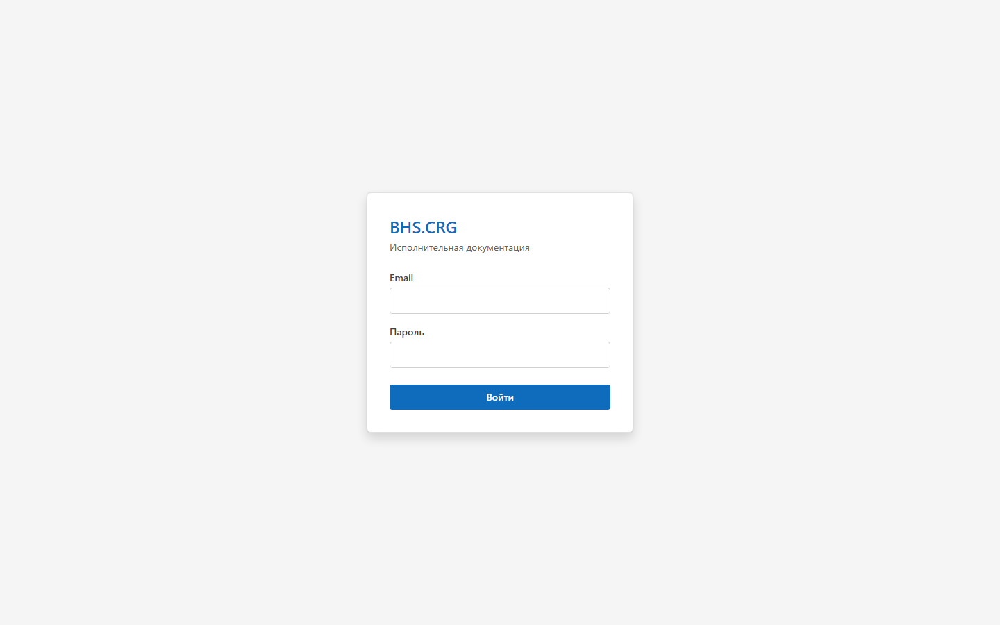

> Учётную запись для вас создаёт администратор. Если не можете войти — обратитесь к нему.
> Сменить свой пароль можно после входа (см. раздел 10).

---

## 2. Общий обзор интерфейса

После входа слева — панель навигации с группой **«Документы и данные»**, в центре —
рабочая область, сверху справа — колокольчик уведомлений. Внизу панели — ваше имя и
роль, кнопки **«Сменить пароль»** и **«Выйти»**.

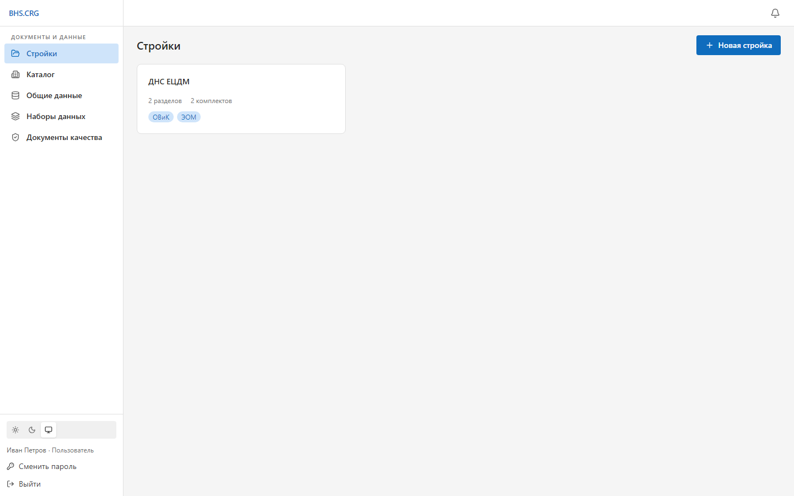

Разделы навигации:

| Раздел | Назначение |
|---|---|
| **Стройки** | Проекты (стройки) → разделы → комплекты документов |
| **Каталог** | Справочник сущностей (организации, лица, объекты и т. п.) |
| **Общие данные** | Общие справочные данные, доступные во всех проектах |
| **Наборы данных** | Табличные данные (например, для ведомостей и журналов) |
| **Документы качества** | Библиотека сертификатов, деклараций, паспортов и привязки к материалам |

---

## 3. Стройки, разделы и комплекты

Работа с документами организована иерархически: **Стройка → Раздел → Комплект → Документы**.

1. На странице **Стройки** выберите стройку (или создайте новую кнопкой **«Новая стройка»**).

   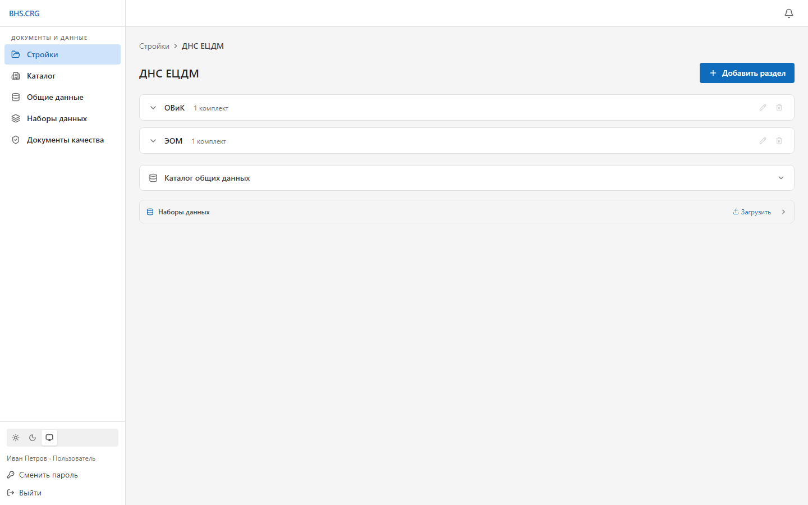

2. Внутри стройки — разделы (например, «ОВиК», «ЭОМ») и комплекты в них. Откройте комплект,
   чтобы увидеть его документы.

   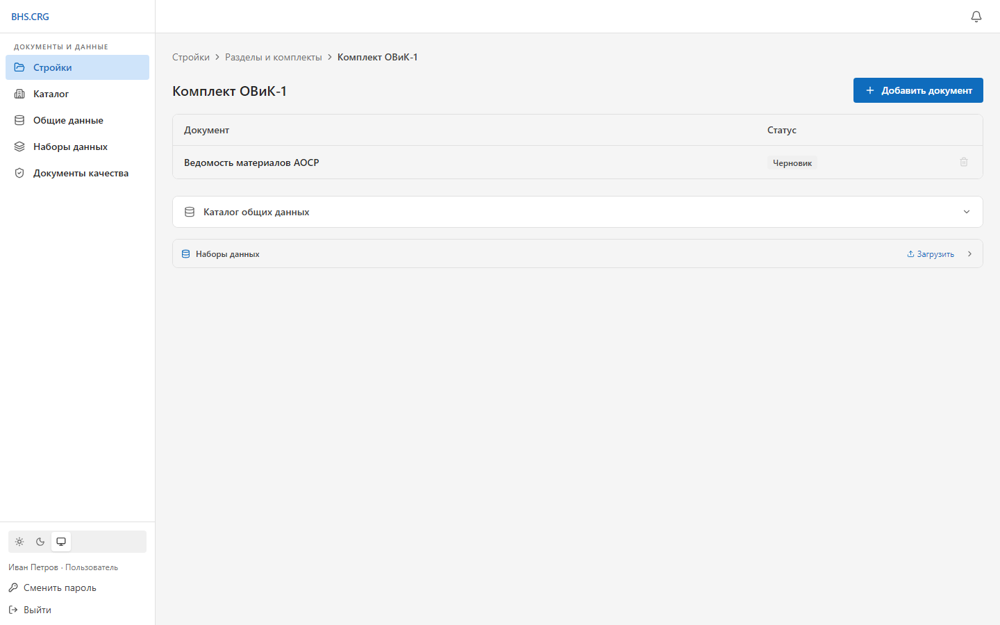

В комплекте также доступны **Каталог общих данных** и **Наборы данных** уровня комплекта.

---

## 4. Работа с документом

### 4.1. Добавление документа
В открытом комплекте нажмите **«Добавить документ»**, выберите тип документа и подтвердите.
Новый документ появится в списке со статусом **«Черновик»**. Щёлкните по строке документа,
чтобы открыть диалог редактирования.

### 4.2. Структура диалога
Диалог документа разделён на вкладки, а **основные действия всегда внизу**:
**Сохранить**, **Сохранить и закрыть**, **Отмена**.

| Вкладка | Что делать |
|---|---|
| **Реквизиты** | Заполнить поля документа |
| **Связи** | Привязать сущности каталога |
| **Данные** | Подключить наборы данных (таблицы) |
| **Документы качества** | Сопоставить материалы с документами качества |
| **Генерация** | Сформировать и скачать PDF |

### 4.3. Реквизиты
Заполните поля. Обязательные отмечены звёздочкой **\***. Часть полей — это ссылки на
каталог: нажмите **«Выбрать из каталога»** и выберите запись; данные подставятся автоматически.

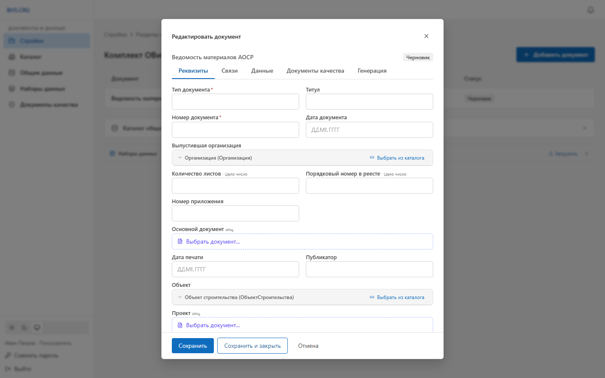

> Изменения на вкладках «Реквизиты» и «Связи» сохраняются кнопкой **«Сохранить»** внизу.
> На остальных вкладках действия применяются сразу (см. подсказку справа от кнопок).

### 4.4. Связи с сущностями
Привязка документа к сущностям каталога (организация, объект и т. п.).

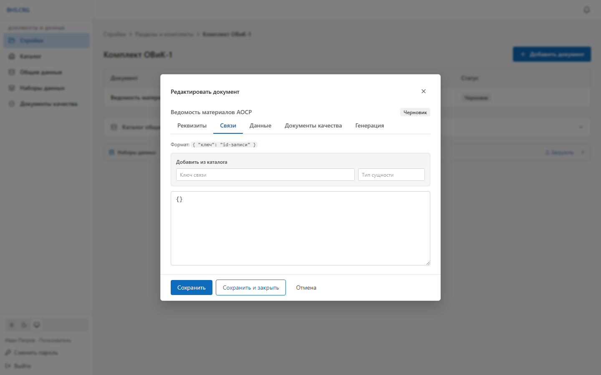

### 4.5. Данные
Подключение табличных данных (наборов данных) — например, для ведомостей материалов или
кабельных журналов. Здесь настраивается, какие колонки откуда брать.

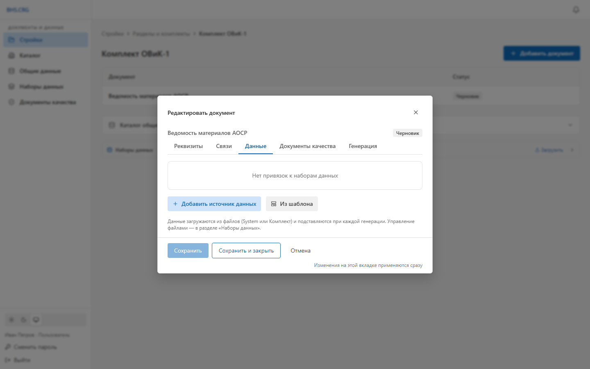

### 4.6. Документы качества
Сопоставление материалов документа с документами качества из библиотеки. Система
показывает материалы и предлагает подходящие документы; их можно привязать кнопкой
**«Привязать»** или принять предложения целиком.

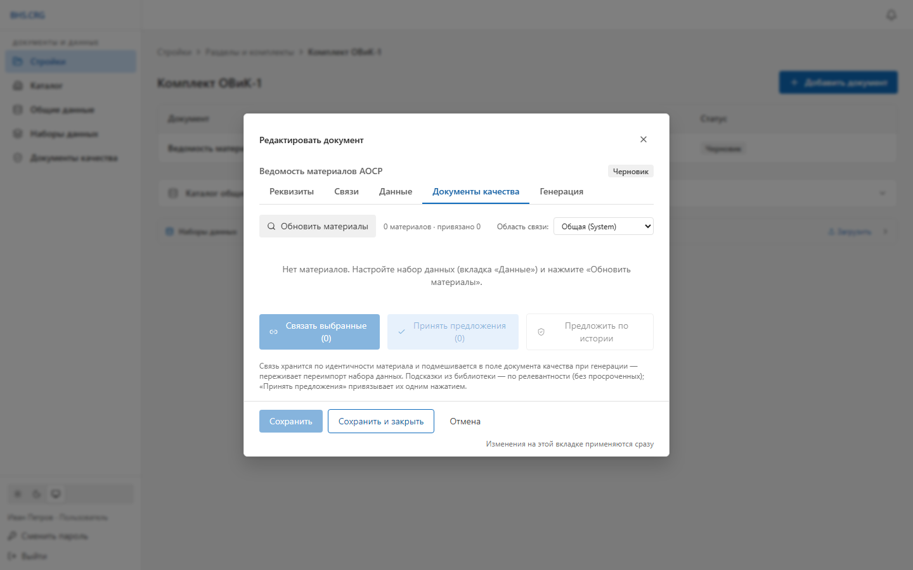

> Привязка хранится по идентичности материала и **подмешивается в документ при генерации** —
> она переживает переимпорт набора данных. Подробнее о библиотеке — раздел 8.

### 4.7. Генерация PDF
На вкладке **«Генерация»** сформируйте документ и скачайте готовый **PDF**.

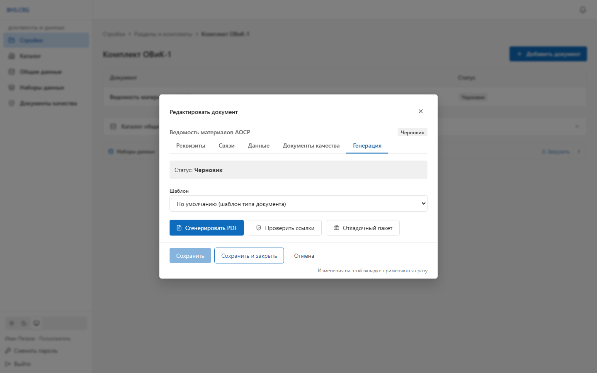

> Если при генерации не заполнены обязательные поля, система сообщит об этом —
> вернитесь на вкладку «Реквизиты» и дозаполните.

---

## 5. Каталог сущностей

Справочник организаций, лиц, объектов и других сущностей, на которые ссылаются документы.
Используйте поиск и фильтр по типу. Добавляйте/редактируйте записи кнопками в строке.

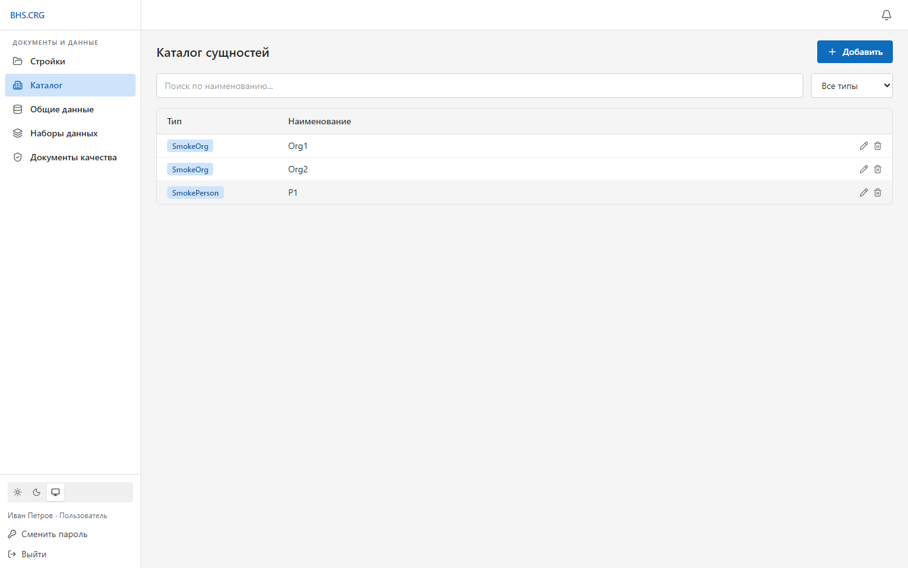

---

## 6. Общие данные

Общие справочные данные, доступные во всех проектах. Заполняются один раз и
переиспользуются в документах.

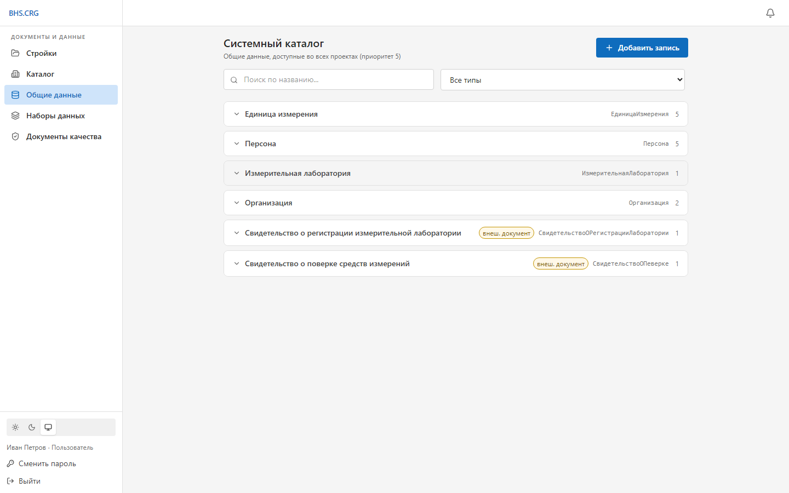

---

## 7. Наборы данных

Табличные данные, которые подключаются к документам (ведомости, журналы). Загрузите файл
(CSV/Excel/XML и др.), при необходимости настройте колонки, фильтры и вычисляемые поля.

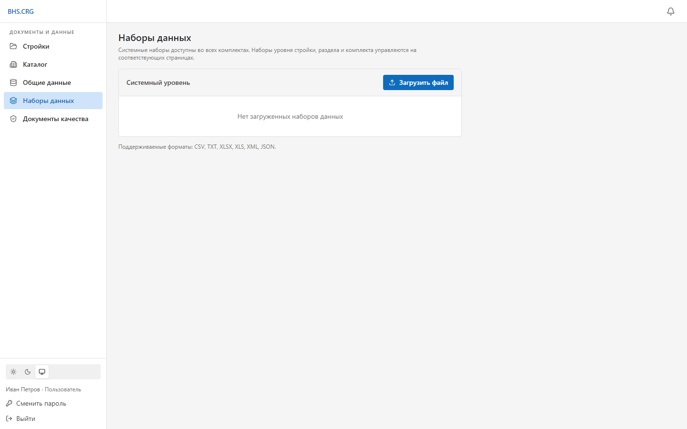

---

## 8. Документы качества

Библиотека сертификатов соответствия, деклараций, паспортов и отказных писем,
сгруппированная по производителям.

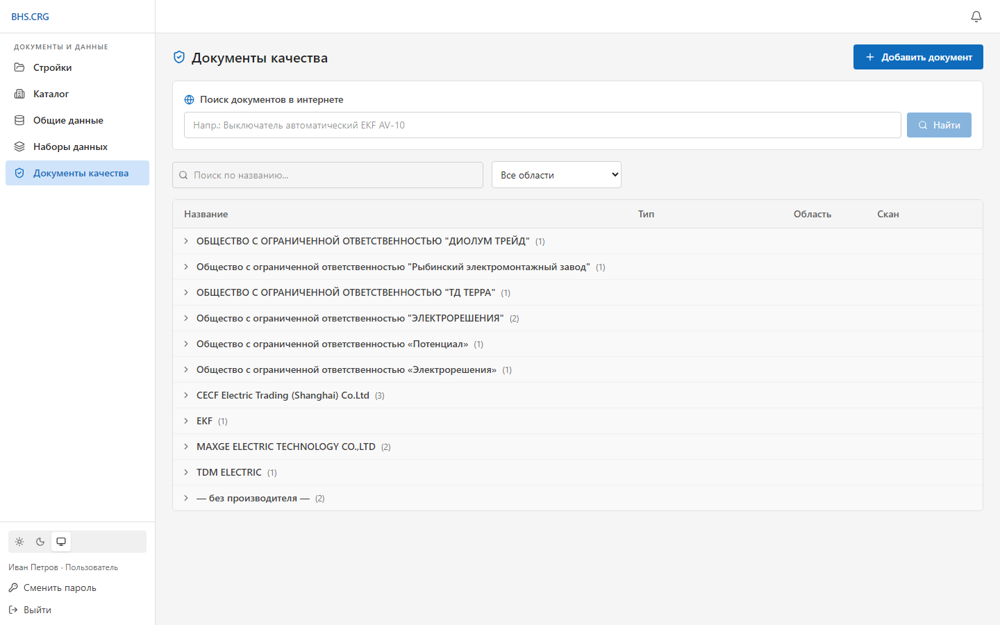

Возможности:
- **Добавить документ** — загрузить скан; реквизиты можно распознать автоматически.
- **Поиск документов в интернете** — найти документ по описанию материала и добавить в
  библиотеку (если настроен веб‑поиск).
- **Привязка к материалам** — выполняется на вкладке «Документы качества» в самом документе
  (раздел 4.6). Привязки автоматически применяются ко всем документам, где встречается
  тот же материал.

---

## 9. Уведомления

Колокольчик в правом верхнем углу показывает уведомления системы (например, о завершении
операций или проблемах). Цифра рядом — число непрочитанных.

---

## 10. Смена пароля

Внизу панели навигации нажмите **«Сменить пароль»**, введите текущий и новый пароль
(минимум 6 символов) и подтвердите.

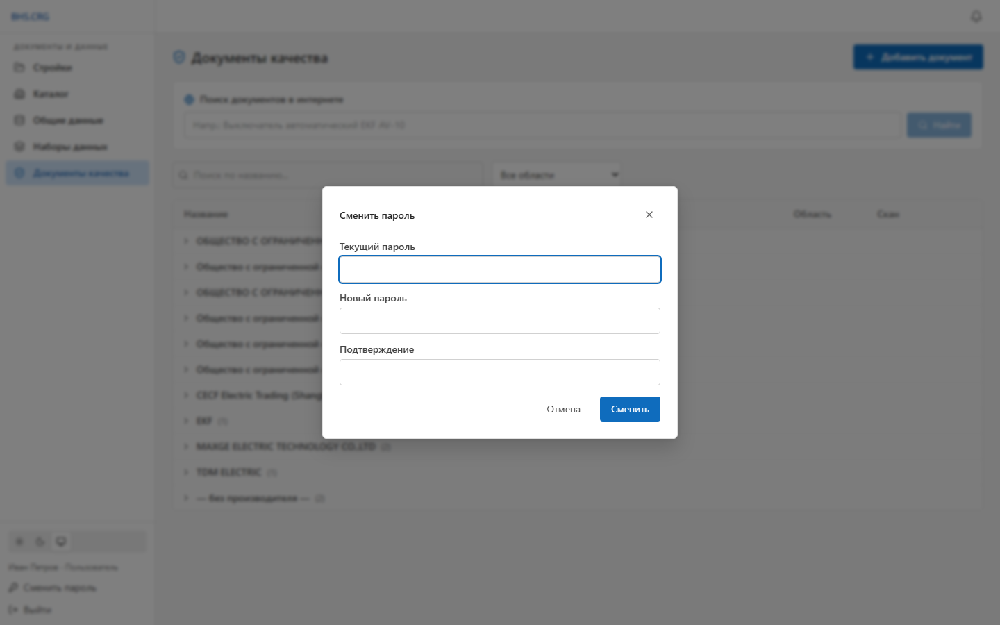

---

## 11. Частые вопросы

**Не вижу разделов «Типы документов», «Настройки» и т. п.**
Это разделы администратора. Роль «Пользователь» работает только с документами и данными.

**Кнопка «Сохранить» неактивна на вкладке «Данные»/«Документы качества»/«Генерация».**
Так и должно быть: на этих вкладках изменения применяются сразу. «Сохранить» нужна только
на «Реквизитах» и «Связях».

**Документ не генерируется.**
Проверьте обязательные поля (со звёздочкой) на вкладке «Реквизиты».

**Забыл пароль.**
Сброс выполняет администратор (он задаст вам новый пароль).
