# Инструкция пользователя BHS.CRG

Система **BHS.CRG** предназначена для подготовки исполнительной документации
электромонтажных проектов: вы создаёте комплекты документов, заполняете реквизиты,
подключаете данные и каталоги и получаете готовые файлы в формате **PDF**.

Эта инструкция — для роли **Пользователь** (работа с документами и данными).
Разделы настройки системы доступны только администратору и здесь не описываются.

---

## 1. Вход в систему

Откройте адрес системы в браузере (его сообщает администратор), введите **email** и
**пароль** и нажмите **Войти**.

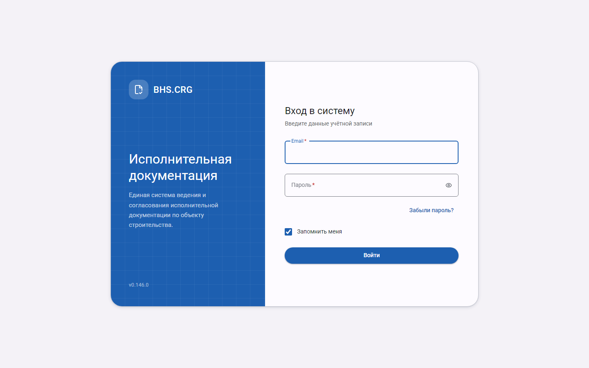

> Учётную запись для вас создаёт администратор. Если не можете войти — обратитесь к нему.
> Сменить свой пароль можно после входа (см. раздел 11).

---

## 2. Общий обзор интерфейса

После входа слева — панель навигации с группой **«Документы и данные»**, в центре —
рабочая область, сверху справа — колокольчик уведомлений. Внизу панели — ваше имя и
роль, кнопки **«Сменить пароль»** и **«Выйти»**.

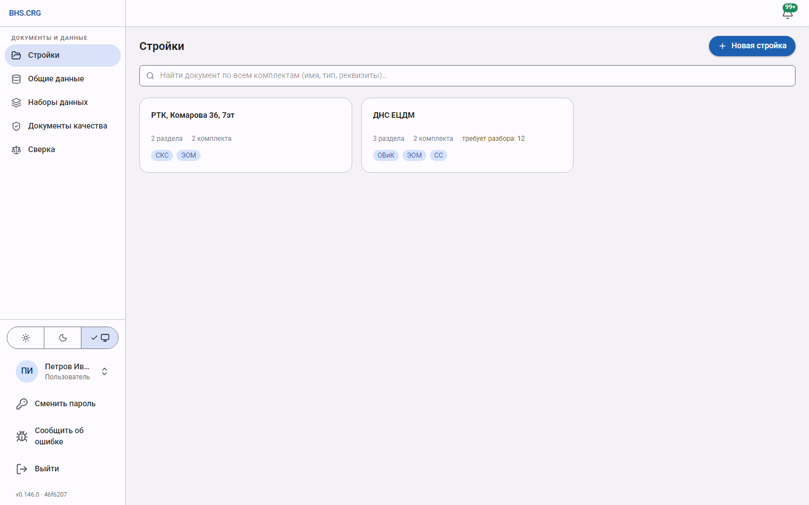

Разделы навигации:

| Раздел | Назначение |
|---|---|
| **Стройки** | Проекты (стройки) → разделы → комплекты документов |
| **Каталог** | Справочник сущностей (организации, лица, объекты и т. п.) |
| **Общие данные** | Общие справочные данные, доступные во всех проектах |
| **Наборы данных** | Табличные данные (например, для ведомостей и журналов) |
| **Документы качества** | Библиотека сертификатов, деклараций, паспортов и привязки к материалам |
| **Сверка** | Сравнение данных между источниками — сходятся ли количества и значения |

---

## 3. Стройки, разделы и комплекты

Работа с документами организована иерархически: **Стройка → Раздел → Комплект → Документы**.

1. На странице **Стройки** выберите стройку (или создайте новую кнопкой **«Новая стройка»**).

   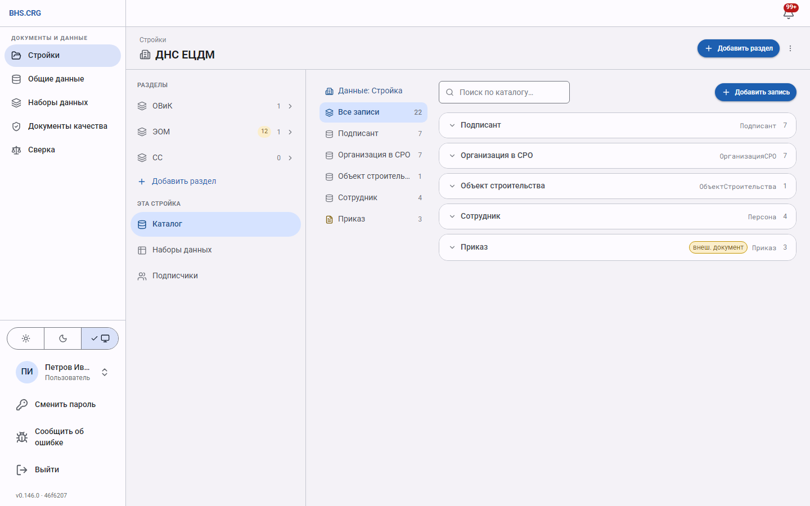

2. Внутри стройки — разделы (например, «ОВиК», «ЭОМ») и комплекты в них. Откройте комплект,
   чтобы увидеть его документы.

   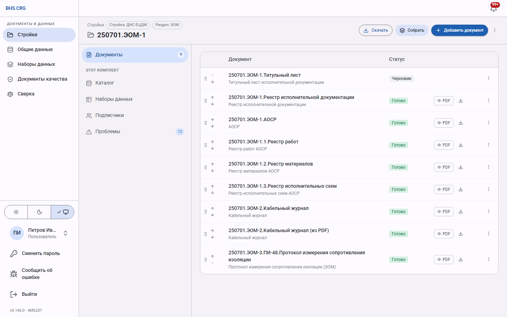

В комплекте также доступны **Каталог общих данных** и **Наборы данных** уровня комплекта.

---

## 4. Работа с документом

### 4.1. Добавление документа
В открытом комплекте нажмите **«Добавить документ»**, выберите тип документа и подтвердите.
Новый документ появится в списке со статусом **«Черновик»**. Щёлкните по строке документа,
чтобы открыть диалог редактирования.

### 4.2. Структура диалога
Диалог документа разделён на вкладки, а **основные действия всегда внизу**:
**Сохранить**, **Сохранить и закрыть**, **Отмена**.

| Вкладка | Что делать |
|---|---|
| **Реквизиты** | Заполнить поля документа |
| **Связи** | Привязать сущности каталога |
| **Данные** | Подключить наборы данных (таблицы) |
| **Документы качества** | Сопоставить материалы с документами качества |
| **Генерация** | Сформировать и скачать PDF |

### 4.3. Реквизиты
Заполните поля. Обязательные отмечены звёздочкой **\***. Часть полей — это ссылки на
каталог: нажмите **«Выбрать из каталога»** и выберите запись; данные подставятся автоматически.

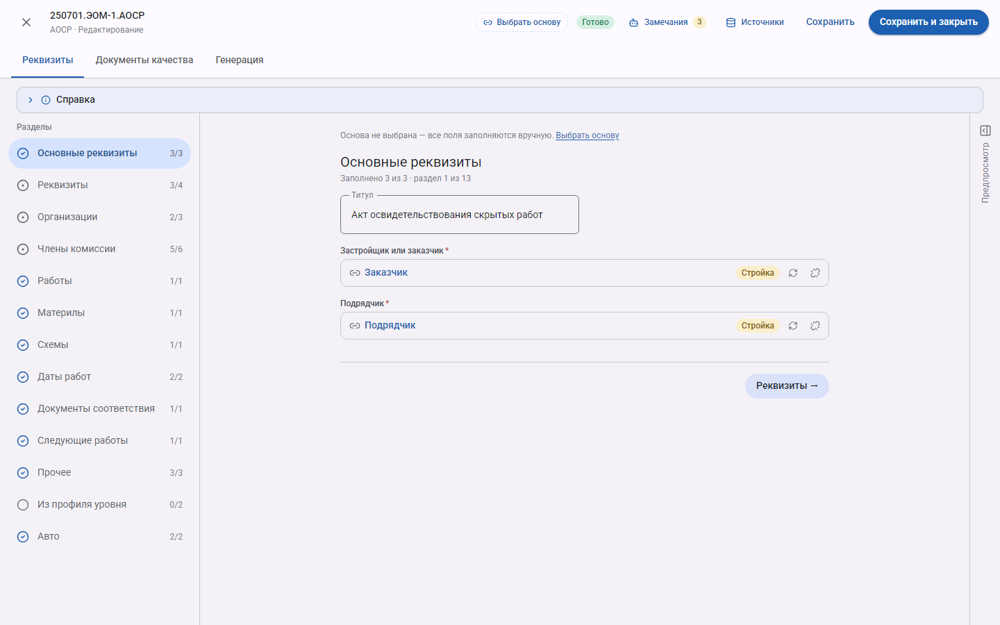

> Изменения на вкладках «Реквизиты» и «Связи» сохраняются кнопкой **«Сохранить»** внизу.
> На остальных вкладках действия применяются сразу (см. подсказку справа от кнопок).

### 4.4. Связи с сущностями
Привязка документа к сущностям каталога (организация, объект и т. п.).

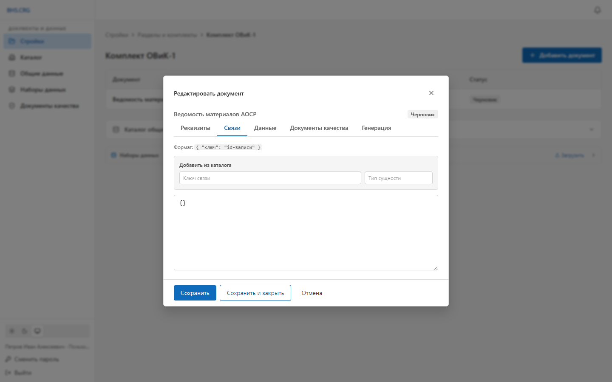

### 4.5. Данные
Подключение табличных данных (наборов данных) — например, для ведомостей материалов или
кабельных журналов. Здесь настраивается, какие колонки откуда брать.

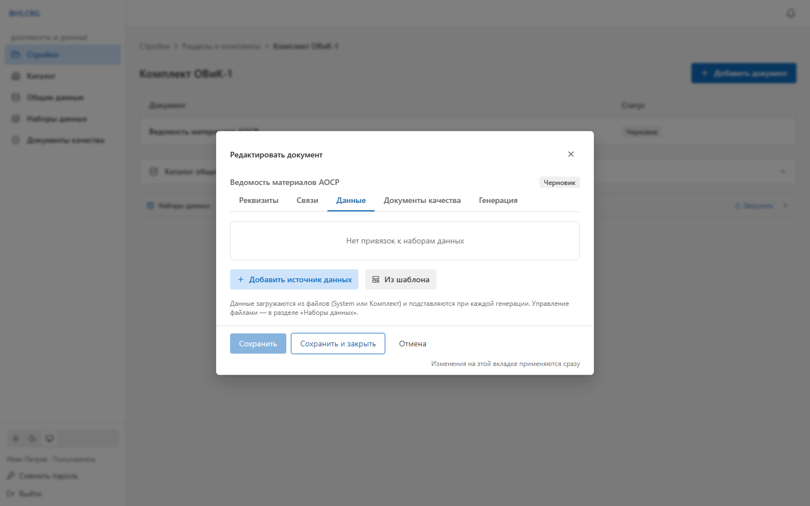

> **PDF-наборы (распознавание проектной документации).** Для PDF данные извлекаются
> распознаванием (ИИ), а не парсингом: реестр листов по ГОСТ-штампу, таблицы спецификаций и
> кабельных журналов. **Точность зависит от движка распознавания**, настроенного администратором:
> облачные (**Claude / Gemini**) распознают штамп/шифр надёжнее, чем офлайн-**Ollama** (у неё
> распознавание реализовано не полностью и может искажать шифр/наименование). Результат всегда
> можно поправить вручную — кнопка **«Редактировать разбиение»** (перенос листов между документами,
> правка шифра/наименования) и **«Перераспознать»** для отдельного документа. Если поля пусты или
> неверны — проверьте с администратором, какой движок включён.

### 4.6. Документы качества
Сопоставление материалов документа с документами качества из библиотеки. Система
показывает материалы и предлагает подходящие документы; их можно привязать кнопкой
**«Привязать»** или принять предложения целиком.

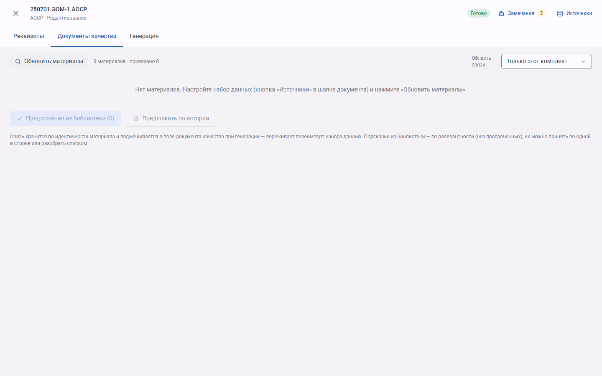

> Привязка хранится по идентичности материала и **подмешивается в документ при генерации** —
> она переживает переимпорт набора данных. Подробнее о библиотеке — раздел 9.

### 4.7. Генерация PDF
На вкладке **«Генерация»** сформируйте документ и скачайте готовый **PDF**.

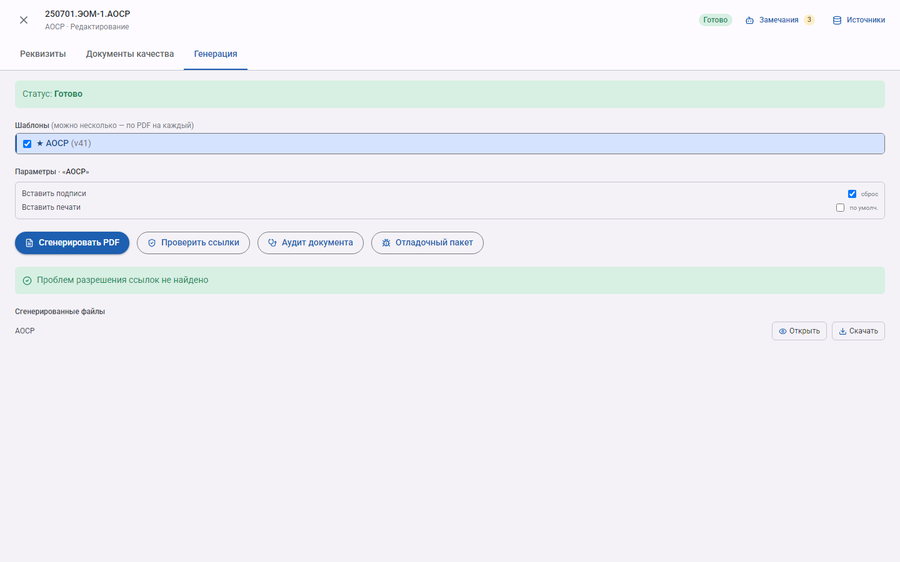

> Если при генерации не заполнены обязательные поля, система сообщит об этом —
> вернитесь на вкладку «Реквизиты» и дозаполните.

---

## 5. Каталог сущностей

Справочник организаций, лиц, объектов и других сущностей, на которые ссылаются документы.
Используйте поиск и фильтр по типу. Добавляйте/редактируйте записи кнопками в строке.

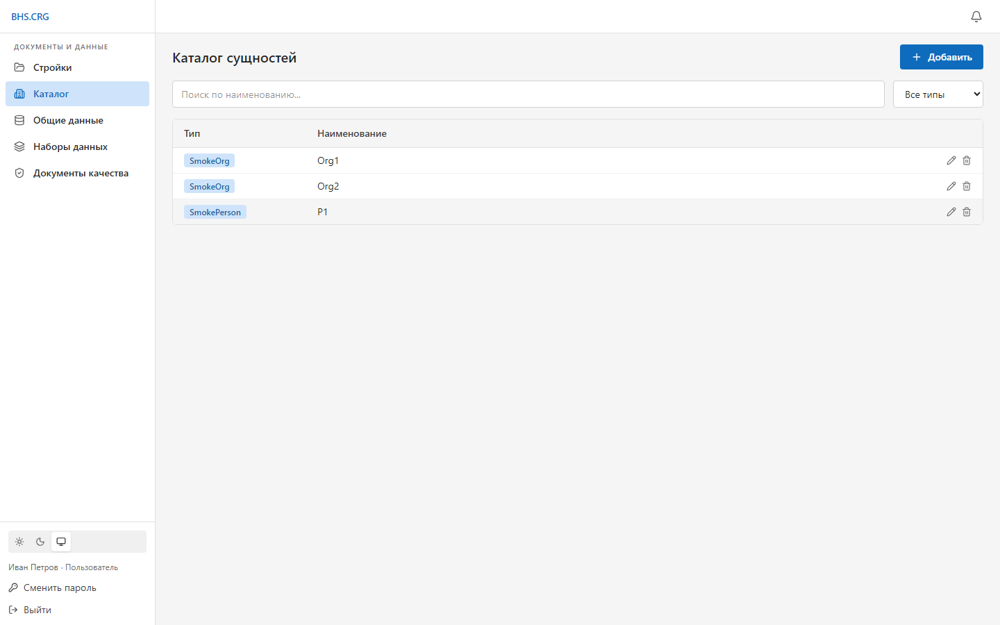

---

## 6. Общие данные

Общие справочные данные, доступные во всех проектах. Заполняются один раз и
переиспользуются в документах.

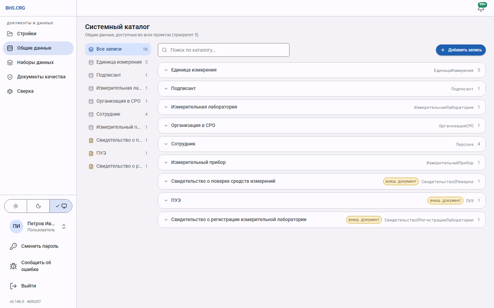

---

## 7. Наборы данных

Табличные данные, которые подключаются к документам (ведомости, журналы). Загрузите файл
(CSV/Excel/XML и др.), при необходимости настройте колонки, фильтры и вычисляемые поля.

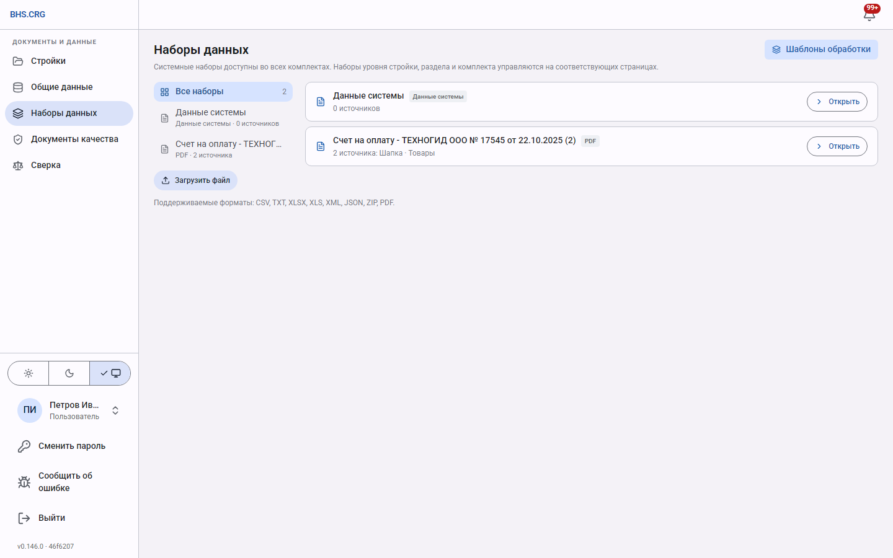

### 7.1. Файл и источники

Загруженный файл — это **сырьё**. К документу подключается не файл, а **источник**: лист книги,
ветка XML, распознанная таблица PDF. У одного файла источников может быть несколько — например,
шапка счёта и его товарные строки.

### 7.2. Обработка источника

У каждого источника своя цепочка обработки, она применяется в этом порядке:

1. **Вычисляемые колонки** — новые колонки, посчитанные по существующим;
2. **Фильтрация строк** — какие строки оставить;
3. **Сортировка строк**.

Вычисляемые колонки идут **до** фильтрации, поэтому по ним можно фильтровать.

Готовую цепочку можно сохранить как **шаблон обработки** и применить к другому источнику —
удобно, когда каждый месяц приходит файл одной и той же формы.

### 7.3. Вычисляемые колонки

Колонка задаётся именем и выражением на JavaScript. К колонке источника можно обратиться
**тремя способами** — они равноправны, выбирайте удобный:

| Способ | Пример | Когда нужен |
|---|---|---|
| по имени | `Фамилия + ' ' + Имя` | имя колонки годится в имя переменной |
| `get("…")` | `get("Кол-во")` | подходит **всегда**, в том числе для имён с пробелами, дефисами и цифрами |
| `cols[n]` | `cols[3]` | по номеру колонки, **счёт с единицы** |

Заголовок вроде `1`, `2`, `3` (обычное дело для таблиц, распознанных из PDF) или `Кол-во`
переменной стать не может: выражение `1` вернёт просто число, а `Кол-во` движок прочитает как
вычитание. Для таких колонок пользуйтесь `get("1")` или `cols[1]`.

Чтобы не набирать имена вручную, нажмите на колонку в списке **«Колонки источника»** — в
выражение подставится то, что действительно работает.

> Пустая ячейка числовой колонки в документ не попадает: в поле останется пусто, а не ноль.

### 7.4. Материализация

Источник можно **развернуть в сущности выбранного типа**: каждая строка станет объектом
(например, измерением или материалом). Маппинг «колонка → поле» задаётся один раз в диалоге
**«Материализация»**, после чего документы совместимого типа ссылаются на источник без
собственной настройки.

### 7.5. Данные системы

Набор бывает и **без файла**: сырьё берётся из самой системы. Кнопка **«Данные системы»** рядом с
«Загрузить файл» создаёт такой набор — по одному на уровень (стройка, раздел, комплект). Источники
у него выбираются из готового списка консолидаций; сегодня это **«Документы комплекта»** —
перечень всех документов того комплекта, в котором создан набор:

| Колонка | Что содержит |
|---|---|
| НомерПП | сквозной номер по порядку в комплекте |
| Наименование | имя документа (если не задано — имя его типа) |
| ТипКод, ТипИмя, Группа | тип документа и его группа |
| Статус | черновик / генерируется / сгенерирован / ошибка |
| НомерДокумента, ДатаДокумента | реквизиты с тэгами «Номер документа» и «Дата документа» |
| ДатаГенерации, КоличествоЛистов | заполняются автоматически при генерации PDF |
| Ид, ПорядокВКомплекте | служебные — для фильтров и отладки |

Три колонки реквизитов берутся **по функциональным тэгам**, а не по именам полей: у каждого типа
документа своя схема, и тэг — единственное, что их связывает. Если у типа нет поля с нужным тэгом
или оно не заполнено, ячейка будет пустой, но строка документа никуда не денется.

Такой источник — обычный: к нему применимы фильтрация, вычисляемые колонки, сортировка, экспорт в
Excel и материализация. Данные **всегда свежие** — они собираются заново при каждом обращении, так
что добавленный в комплект документ появляется в источнике сразу, без «обновить».

#### Реестр документов комплекта

Типовой сценарий (настраивает администратор):

1. **Составной тип** «СтрокаРеестра» с полями будущей таблицы: номер, наименование, номер
   документа, дата, количество листов.
2. **Тип документа** «Реестр документов» с полем-массивом (тип элемента — «СтрокаРеестра»).
3. В комплекте: **«Данные системы»** → источник **«Документы комплекта»**.
4. В документе-реестре, на вкладке наборов данных, привязать источник к полю-массиву и сопоставить
   колонки полям.
5. **Шаблон** Typst печатает массив таблицей. Какую дату показывать — заполненную вручную
   (`ДатаДокумента`) или дату генерации PDF (`ДатаГенерации`) — решает шаблон: источник отдаёт обе.

Группы реестра («Основные документы», «Сертификаты») делаются **несколькими источниками на одну
консолидацию** — одни и те же живые данные, разные фильтры, разные поля документа. Два пути:

- **«Добавить ещё»** у той же консолидации в списке «Доступно из данных системы» — уже добавленная
  консолидация остаётся видимой, с пометкой «уже добавлен»; новый источник заводится пустым;
- **«Создать копию…»** в меню источника — копия наследует фильтр, вычисляемые колонки, сортировку и
  материализацию (вместе с правилом выбора варианта), останется поправить только отличия.

Оба пути спрашивают название, и оно обязано быть свободным: при привязке источники различимы
**только названием**, поэтому два «Документы комплекта» подряд означали бы выбор наугад. Называйте
по назначению — «Основные документы», «Сертификаты», — а не «копия».

#### Разные виды документов в одном реестре

Если строки реестра должны выглядеть по-разному — титульный лист одним набором полей, АОСР другим,
— тип строки делают **union'ом** («заполняется ровно один вариант»), а в диалоге материализации
выбирают режим **«вариант по типу документа строки»**.

В этом режиме указываются:

- **колонка-признак** — по ней определяется, что за документ в строке. У источника «Документы
  комплекта» это «ТипКод» (код типа) либо «Ид» (сам документ);
- **какие типы документов относятся к какому варианту**. Правило на тип забирает и все его подвиды,
  поэтому перечислять потомков не нужно. Вариант, которому не назначено ни одного типа, **выключен**:
  строки таких документов в реестр не попадают — это законная настройка, если реестр собирает не всё.

Предпросмотр показывает вариант каждой строки и **отдельно перечисляет пропущенные** — с указанием,
почему: тип не назначен ни одному варианту, код типа не распознан, документ по идентификатору не
найден. Смотреть туда стоит до генерации: недостача в готовом реестре в глаза не бросается.

Настройка не сохранится, если она противоречива — например, один тип назначен двум вариантам сразу
или варианту назначены типы, но не задан маппинг колонок.

> Если у привязки задан **собственный** маппинг, он замещает материализацию целиком — вместе с
> правилом выбора варианта. Плоский маппинг привязки построчную вариативность не выражает.

> Реестр — тоже документ комплекта и попадает в собственный перечень. Система его не исключает сама:
> реестры по ГОСТ вполне законно включают себя, и скрытое правило пришлось бы обходить. Если это не
> нужно, исключите его **фильтром строк** по типу документа.
>
> Количество листов у соседних документов известно только после их генерации. При сборке комплекта
> система учитывает это сама: документы, читающие данные системы, перегенерируются **после**
> остальных. При одиночной генерации реестр показывает то, что есть в системе на этот момент.

---

## 8. Сверка

Сверка отвечает на вопрос «сходятся ли данные между собой»: например, совпадают ли количества
в спецификации проекта и в ведомости смонтированных материалов.

### 8.1. Из чего состоит сверка

- **Две стороны** — «слева» и «справа». Каждая сторона это один или несколько источников данных;
  у каждого указываются **ключевые колонки** (по ним строки сопоставляются) и **колонка значения**
  (её и сравниваем). Несколько источников на стороне складываются в свод.
- **Правило сравнения** — «равно», «не меньше» или «не больше», с **допуском**: абсолютным
  (например, ±0,5) или в процентах. Пример настроенной сверки: «Кабель: проложено ≥ проектного» —
  слева фактическая длина по марке и сечению, справа проектная, правило «не меньше» без допуска.

### 8.2. Прогон и находки

Кнопка **«Запустить»** выполняет сверку и сохраняет **прогон**. Каждая строка результата — находка
с одним из состояний:

| Состояние | Значение |
|---|---|
| Совпадает | значения сошлись в пределах допуска |
| Расхождение | не сошлись |
| Нет слева / Нет справа | строка есть только на одной стороне |

Прогоны копятся, поэтому результат можно сравнить с предыдущим. Если прогон завершился неудачей,
у него **всегда указана причина** — пустой список находок без неё читался бы как «расхождений
нет», а это самое опасное недоразумение в сверке.

### 8.3. Что делать с находкой

- **Признать нормой** — расхождение объяснимо (например, технологический запас). Находка перестаёт
  требовать внимания, решение сохраняется и переносится на следующие прогоны.
- **Исключить из сверки** — строку сравнивать не нужно вовсе.
- **Синонимы** — если один и тот же материал назван в источниках по-разному, свяжите названия
  синонимом. Система предлагает синонимы сама; предложение нужно подтвердить, и дальше оно
  применяется автоматически.

Решение привязано не к прогону, а к самой позиции, поэтому следующий прогон помнит, что уже
разобрано.

### 8.4. Замечания внешнего анализа

Отдельная панель — **журнал замечаний**. Это утверждения внешнего ИИ-агента, а не результат
проверки системой: у каждого замечания видно происхождение, и его нужно просмотреть
человеку. Не путайте их с находками сверки — те посчитаны по вашим данным детерминированно.

### 8.5. Отчёт

**Отчёт о расхождениях** выгружается в Excel и собирается **по комплекту документов** — так же,
как его сегодня ведут вручную: выберите комплект и нажмите выгрузку.

---

## 9. Документы качества

Библиотека сертификатов соответствия, деклараций, паспортов и отказных писем,
сгруппированная по производителям.

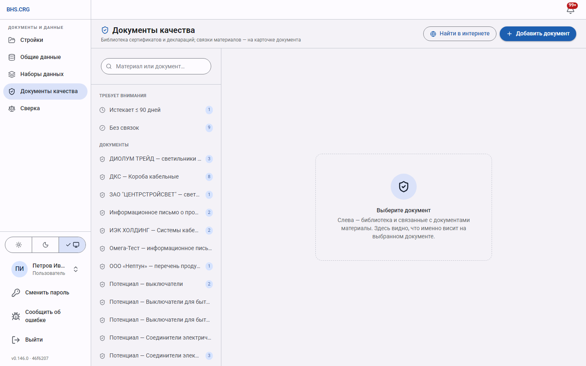

Возможности:
- **Добавить документ** — загрузить скан; реквизиты можно распознать автоматически.
- **Поиск документов в интернете** — найти документ по описанию материала и добавить в
  библиотеку (если настроен веб‑поиск).
- **Привязка к материалам** — выполняется на вкладке «Документы качества» в самом документе
  (раздел 4.6). Привязки автоматически применяются ко всем документам, где встречается
  тот же материал.

---

## 10. Уведомления

Колокольчик в правом верхнем углу показывает уведомления системы (например, о завершении
операций или проблемах). Цифра рядом — число непрочитанных.

---

## 11. Смена пароля

Внизу панели навигации нажмите **«Сменить пароль»**, введите текущий и новый пароль
(минимум 6 символов) и подтвердите.

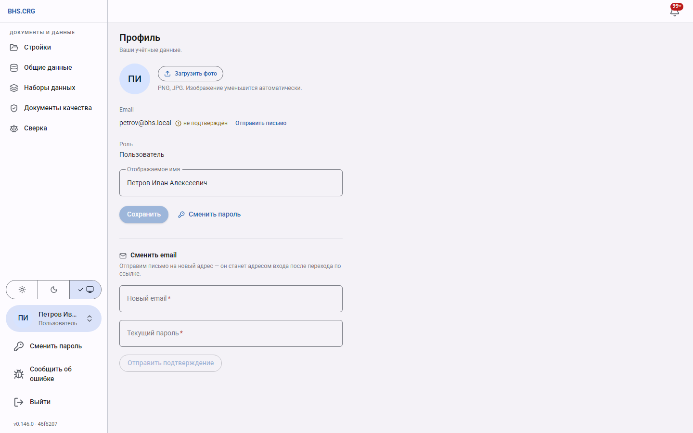

---

## 12. Частые вопросы

**Не вижу разделов «Типы документов», «Настройки» и т. п.**
Это разделы администратора. Роль «Пользователь» работает только с документами и данными.

**Кнопка «Сохранить» неактивна на вкладке «Данные»/«Документы качества»/«Генерация».**
Так и должно быть: на этих вкладках изменения применяются сразу. «Сохранить» нужна только
на «Реквизитах» и «Связях».

**Документ не генерируется.**
Проверьте обязательные поля (со звёздочкой) на вкладке «Реквизиты».

**Забыл пароль.**
Сброс выполняет администратор (он задаст вам новый пароль).
