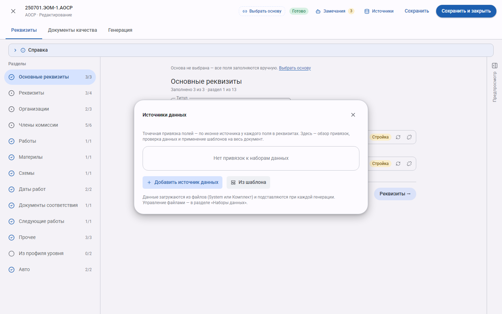
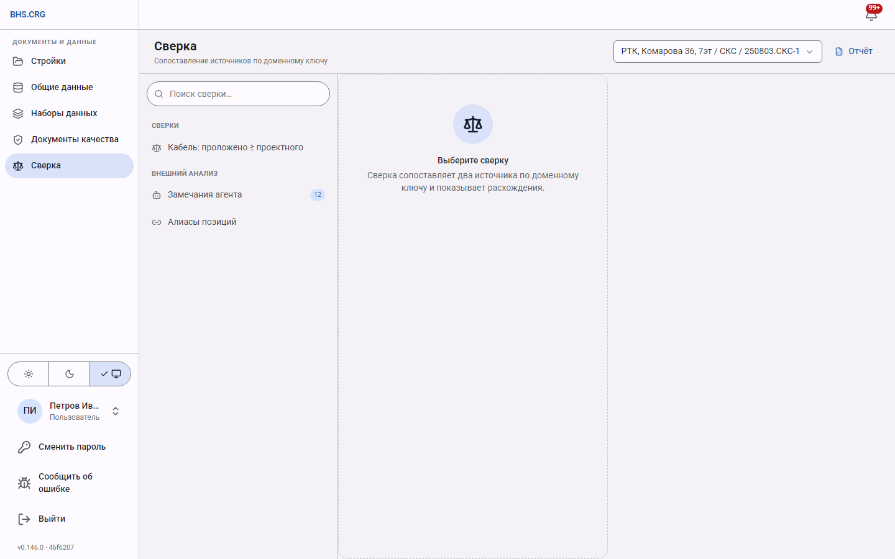
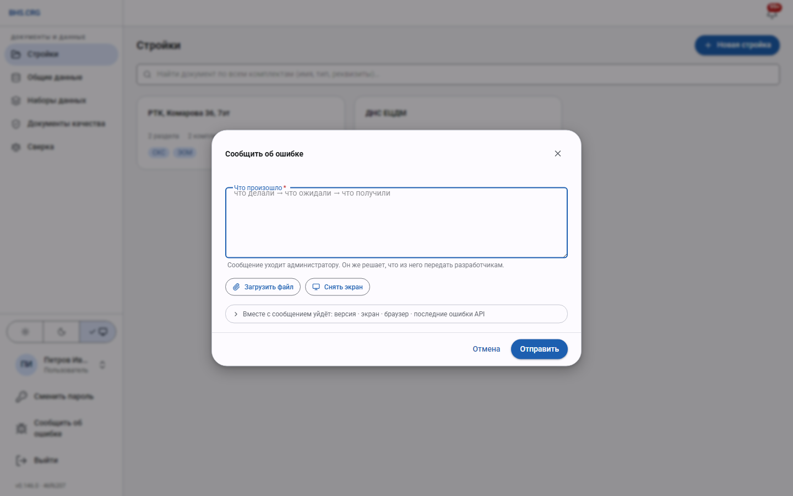
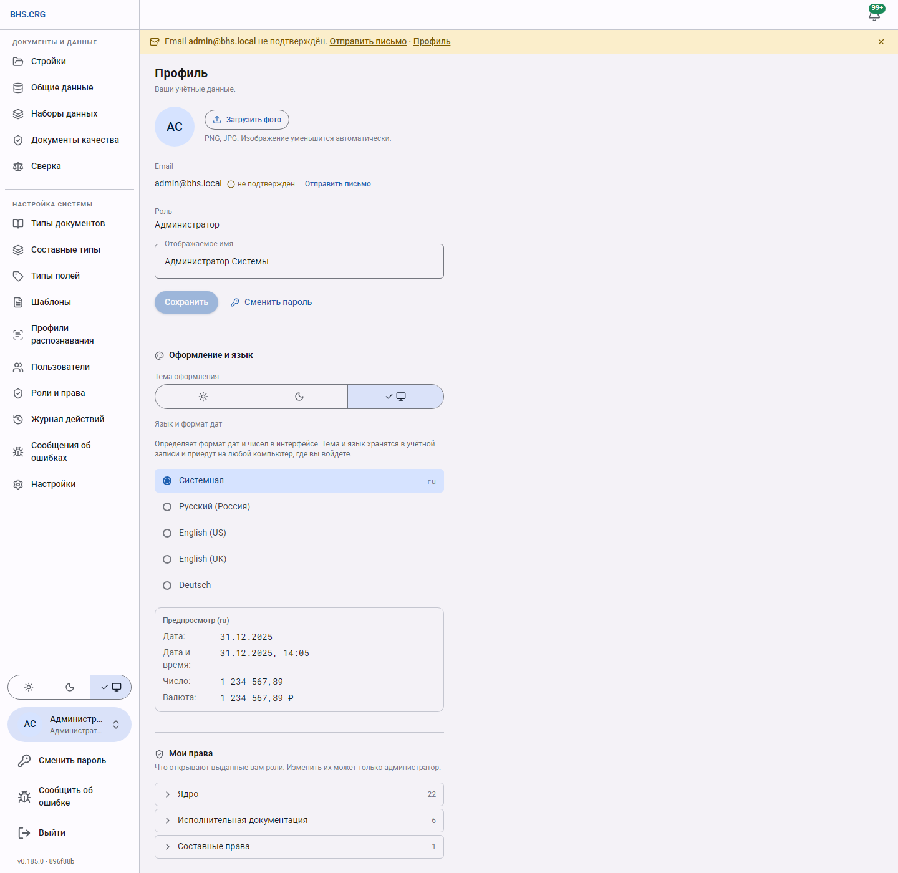

# Инструкция пользователя BHS.CRG

Система **BHS.CRG** предназначена для подготовки исполнительной документации
электромонтажных проектов: вы создаёте комплекты документов, заполняете реквизиты,
подключаете данные и каталоги и получаете готовые файлы в формате **PDF**.

Эта инструкция — для роли **Пользователь** (работа с документами и данными).
Разделы настройки системы доступны только администратору и здесь не описываются.

---

## 1. Вход в систему

Откройте адрес системы в браузере (его сообщает администратор), введите **email** и
**пароль** и нажмите **Войти**.

Забыли пароль — нажмите **«Забыли пароль?»** под полями: система пришлёт письмо со ссылкой на
смену. Ссылка живёт час и срабатывает один раз.

> Письмо не приходит — почта в системе может быть не настроена; тогда пароль сбрасывает
> администратор. Учётную запись для вас тоже создаёт он.
> Свои данные и пароль вы меняете сами после входа — раздел 11.

---

## 2. Общий обзор интерфейса

После входа слева — панель навигации с группой **«Документы и данные»**, в центре —
рабочая область, сверху справа — колокольчик уведомлений (рядом с ним появляется пилюля
выполняющихся задач, см. раздел 9).

Внизу панели, сверху вниз: переключатель темы (светлая / тёмная / как в системе), пилюля с
вашим именем и ролью — она ведёт в **Профиль** (раздел 11), **«Сменить пароль»**,
**«Сообщить об ошибке»** (раздел 10), **«Выйти»**. Самой нижней строкой — версия системы.

Разделы навигации:

| Раздел | Назначение |
|---|---|
| **Стройки** | Проекты (стройки) → разделы → комплекты документов |
| **Общие данные** | Справочные данные, на которые ссылаются документы: организации, лица, объекты — и всё прочее, заведённое администратором |
| **Наборы данных** | Табличные данные (например, для ведомостей и журналов) |
| **Документы качества** | Библиотека сертификатов, деклараций, паспортов и привязки к материалам |
| **Сверка** | Сравнение данных между источниками — сходятся ли количества и значения |

**С клавиатуры.** **Ctrl + K** открывает командную палитру — переход в любой раздел по первым
буквам названия, без мыши. Клавиша **?** (когда курсор не в поле ввода) показывает
общий список сочетаний — он один на всю систему, часть из них работает на определённых экранах
(например, **← →** переключают вкладки в редакторе документа).

---

## 3. Стройки, разделы и комплекты

Работа с документами организована иерархически: **Стройка → Раздел → Комплект → Документы**.

1. На странице **Стройки** выберите стройку (или создайте новую кнопкой **«Новая стройка»**).

   Строка поиска над карточками ищет **документ по всем комплектам сразу** — по имени, типу
   документа и содержимому реквизитов. Это короткий путь, когда помните документ, но не помните,
   в каком он комплекте.

   На карточке стройки рядом с числом разделов и комплектов может стоять **«требует разбора: N»**.
   Это счётчик **сверки**: неразобранные находки её прогонов плюс непросмотренные замечания
   внешнего анализа по этой стройке (раздел 7). Разбираются они в разделе «Сверка» — там же
   счётчик и обнуляется, когда по каждой находке принято решение.

   

2. Внутри стройки — разделы (например, «ОВиК», «ЭОМ») и комплекты в них. Откройте комплект,
   чтобы увидеть его документы.

   

В комплекте также доступны **Каталог общих данных** и **Наборы данных** уровня комплекта.

### 3.1. План по документам и готовность

План отвечает на вопрос «сколько ещё осталось». Задаётся он **только на комплекте** — пункт
**«План»** в его левой навигации: добавьте типы документов и укажите, сколько каждого должно быть.

Дальше система считает сама:

- **готовым считается выпущенный документ** — тот, у которого сформирован PDF. Черновик позицию не
  закрывает: план считает выпущенное, а не заведённые карточки;
- **документы сверх плана процент не поднимают**, а типы, которых в плане нет, в него не входят
  вовсе. Пять актов при плане в три — это три закрытые позиции и два документа сверх плана;
- **раздел и стройка считаются сами** — складывают свои комплекты. Отдельно задавать план на них
  не нужно и нельзя;
- **комплекты без плана в процент не входят**, но и не молчат: рядом видно «без плана: N
  комплектов». Иначе «раздел на 100 %» означало бы «единственный расписанный комплект закрыт».

Процент показывается в шапке комплекта, раздела и стройки, в строках списков и на карточках строек.
**Плана нет — процента нет:** там, где не планировали, ничего и не должно.

> **100 % показывается, только когда план закрыт И у сверки нет неразобранного.** Если разобрать
> что-то осталось, процент останавливается на 99 % и рядом стоит «не разобрано: N» — это не сбой
> счёта, а напоминание: комплект по количеству собран, но данные ещё не сверены (раздел 7).

План ничего не запрещает: документ вне плана заводится как обычно, комплект собирается как обычно.
Это индикатор, а не замок.

---

## 4. Работа с документом

### 4.1. Добавление документа
В открытом комплекте нажмите **«Добавить документ»**, выберите тип документа и подтвердите.
Новый документ появится в списке со статусом **«Черновик»**. Щёлкните по строке документа,
чтобы открыть диалог редактирования.

### 4.2. Структура диалога
Документ открывается на весь экран. Слева вверху — его имя и тип, справа — действия, ниже —
вкладки.

| Вкладка | Что делать |
|---|---|
| **Реквизиты** | Заполнить поля документа — в том числе ссылки на записи каталога |
| **Документы качества** | Сопоставить материалы с документами качества |
| **Генерация** | Сформировать и скачать PDF |

> Вкладок бывает две: **«Документы качества» показывается только у типов, где есть материалы**
> (реестр материалов, кабельный журнал). У протокола измерений или титульного листа её нет, и это
> не сбой настройки.

В шапке, рядом с именем:

| Кнопка | Что делает |
|---|---|
| **Выбрать основу** | Взять реквизиты из другого документа — «основы»: заполненное в ней подставляется сюда и обновляется вместе с ней (раздел 4.3). Появляется, когда в комплекте есть подходящий документ |
| Статус («Черновик», «Готово») | Показывает состояние документа |
| **Замечания** | Замечания к документу; цифра — сколько неразобранных. Нет замечаний — нет и кнопки |
| **Источники** | Обзор привязок к наборам данных и применение шаблонов на весь документ (раздел 4.4) |
| **Сохранить**, **Сохранить и закрыть** | Записать изменения. Показываются **только на «Реквизитах»**: на других вкладках сохранять нечего, там всё применяется сразу |

### 4.3. Реквизиты
Поля сгруппированы в **разделы** — они перечислены слева, у каждого счётчик вида «3/4»:
заполнено из скольких. Обязательные поля отмечены звёздочкой **\***; пока они пусты, документ
не сгенерируется.

**Поля-ссылки** — те, что указывают на запись каталога (организацию, лицо, объект). Значок цепочки
перед значением означает, что это ссылка, а не набранный текст: данные подставляются из записи и
обновляются вместе с ней. Рядом со значением — метка уровня, откуда взята запись («Стройка»,
«Комплект»), и две кнопки: **«Заменить ссылку»** открывает выбор записи, **«Снять ссылку»**
**очищает поле целиком** — не превращает ссылку в текст, а стирает значение, так что заполнять
придётся заново.

**«Выбрать основу»** (в шапке) берёт реквизиты другого документа за образец: общие поля —
подрядчик, объект, комиссия — заполняются из него и остаются связанными. Пока основа не выбрана,
об этом сказано строкой над первым разделом.

Изменения записываются кнопкой **«Сохранить»** — она есть только здесь; на «Документах качества»
и «Генерации» действия применяются сразу, и кнопок сохранения там нет вовсе.

### 4.4. Источники данных
Таблицы — ведомости материалов, кабельные журналы, реестры — приходят в документ из **наборов
данных**. Кнопка **«Источники»** в шапке открывает обзор: какие наборы привязаны, всё ли с ними в
порядке, и позволяет применить готовый шаблон привязки на весь документ.

Точечно — какое поле из какой колонки — привязывается **у самого поля**, значком источника в
реквизитах. Данные подставляются при каждой генерации, то есть документ всегда собирается из
текущего содержимого набора; управление самими файлами — в разделе «Наборы данных» (раздел 6).

> **PDF-наборы (распознавание проектной документации).** Для PDF данные извлекаются
> распознаванием (ИИ), а не парсингом: реестр листов по ГОСТ-штампу, таблицы спецификаций и
> кабельных журналов. **Точность зависит от движка распознавания**, настроенного администратором:
> облачные (**Claude / Gemini**) распознают штамп/шифр надёжнее, чем офлайн-**Ollama** (у неё
> распознавание реализовано не полностью и может искажать шифр/наименование). Результат всегда
> можно поправить вручную — кнопка **«Редактировать разбиение»** (перенос листов между документами,
> правка шифра/наименования) и **«Перераспознать»** для отдельного документа. Если поля пусты или
> неверны — проверьте с администратором, какой движок включён.

### 4.5. Документы качества
Сопоставление материалов документа с документами качества из библиотеки. Сверху — счётчик вида
«130 материалов · привязано 54» и **область связи**: действует привязка только в этом комплекте
или шире.

Каждой строке материала соответствует документ качества. Привязать можно двумя путями: **вручную**
— значками в конце строки (выбрать документ, снять привязку) — или **списком**: кнопка
**«Предложения из библиотеки (N)»** показывает подобранные по релевантности (просроченные не
предлагаются), а **«Предложить по истории»** — те, что вы уже привязывали к такому же материалу
раньше. Предложения принимаются по одному или разбираются все сразу.

> Привязка хранится по идентичности материала и **подмешивается в документ при генерации** —
> она переживает переимпорт набора данных. Подробнее о библиотеке — раздел 8.

### 4.6. Генерация PDF
На вкладке **«Генерация»** сформируйте документ и скачайте готовый **PDF**.

> Если при генерации не заполнены обязательные поля, система сообщит об этом —
> вернитесь на вкладку «Реквизиты» и дозаполните.

---

## 5. Общие данные

Справочник, на который ссылаются документы: организации, лица, объекты — и любые другие виды
записей, заведённые администратором. Заполняются один раз и переиспользуются во всех документах:
поменяв здесь адрес организации, вы меняете его сразу везде, где на неё ссылались.

Раздел открывается на системном уровне — заголовок экрана так и называется, **«Системный каталог»**.
Слева — виды записей со счётчиками, справа — сами записи. Ищутся строкой поиска, добавляются
кнопкой **«Добавить запись»**.

В формах документа этот же справочник называется **каталогом** — кнопка **«Выбрать из каталога»**
в поле‑ссылке (раздел 4.3) открывает именно его записи.

> Записи живут на разных уровнях: система → стройка → раздел → комплект. Заведённое на верхнем
> уровне видно на всех нижних, а одноимённая запись нижнего уровня перекрывает верхнюю — так
> общий подрядчик задаётся один раз, а «свой» на одной стройке подменяет его только там.

---

## 6. Наборы данных

Табличные данные, которые подключаются к документам (ведомости, журналы). Загрузите файл
(CSV/Excel/XML и др.), при необходимости настройте колонки, фильтры и вычисляемые поля.

### 6.1. Файл и источники

Загруженный файл — это **сырьё**. К документу подключается не файл, а **источник**: лист книги,
ветка XML, распознанная таблица PDF. У одного файла источников может быть несколько — например,
шапка счёта и его товарные строки.

### 6.2. Наборы верхних уровней

Набор живёт на уровне, где его загрузили: комплект, раздел, стройка или система. **Наборы верхних
уровней доступны на нижних**: справочник, загруженный на стройку, подключается к документам любого
её комплекта, а системный — к документам всех строек.

В списке наборов уровня свои идут первыми, а под ними — свёрнутая строка
**«Доступны здесь: ещё N наборов с верхних уровней»**. Разверните её, чтобы увидеть остальные:
у каждого подписан уровень-владелец — «Раздел», «Стройка», «Система».

Унаследованный набор открывается и правится как свой: у него те же источники, фильтры и
материализация. Помните, что он **общий** — заменив файл или удалив набор раздела с экрана
комплекта, вы измените его для всех комплектов этого раздела. Перед удалением система об этом
предупреждает.

### 6.3. Обработка источника

У каждого источника своя цепочка обработки, она применяется в этом порядке:

1. **Вычисляемые колонки** — новые колонки, посчитанные по существующим;
2. **Фильтрация строк** — какие строки оставить;
3. **Сортировка строк**.

Вычисляемые колонки идут **до** фильтрации, поэтому по ним можно фильтровать.

Готовую цепочку можно сохранить как **шаблон обработки** и применить к другому источнику —
удобно, когда каждый месяц приходит файл одной и той же формы.

### 6.4. Вычисляемые колонки

Колонка задаётся именем и выражением на JavaScript. К колонке источника можно обратиться
**тремя способами** — они равноправны, выбирайте удобный:

| Способ | Пример | Когда нужен |
|---|---|---|
| по имени | `Фамилия + ' ' + Имя` | имя колонки годится в имя переменной |
| `get("…")` | `get("Кол-во")` | подходит **всегда**, в том числе для имён с пробелами, дефисами и цифрами |
| `cols[n]` | `cols[3]` | по номеру колонки, **счёт с единицы** |

Заголовок вроде `1`, `2`, `3` (обычное дело для таблиц, распознанных из PDF) или `Кол-во`
переменной стать не может: выражение `1` вернёт просто число, а `Кол-во` движок прочитает как
вычитание. Для таких колонок пользуйтесь `get("1")` или `cols[1]`.

Чтобы не набирать имена вручную, нажмите на колонку в списке **«Колонки источника»** — в
выражение подставится то, что действительно работает.

> Пустая ячейка числовой колонки в документ не попадает: в поле останется пусто, а не ноль.

### 6.5. Материализация

Источник можно **развернуть в сущности выбранного типа**: каждая строка станет объектом
(например, измерением или материалом). Маппинг «колонка → поле» задаётся один раз в диалоге
**«Материализация»**, после чего документы совместимого типа ссылаются на источник без
собственной настройки.

### 6.6. Данные системы

Набор бывает и **без файла**: сырьё берётся из самой системы. Кнопка **«Данные системы»** рядом с
«Загрузить файл» создаёт такой набор — по одному на уровень (стройка, раздел, комплект). Источники
у него выбираются из готового списка консолидаций; сегодня это **«Документы комплекта»** —
перечень всех документов того комплекта, в котором создан набор:

| Колонка | Что содержит |
|---|---|
| НомерПП | сквозной номер по порядку в комплекте |
| Наименование | имя документа (если не задано — имя его типа) |
| ТипКод, ТипИмя, Группа | тип документа и его группа |
| Статус | черновик / генерируется / сгенерирован / ошибка |
| НомерДокумента, ДатаДокумента | реквизиты с тэгами «Номер документа» и «Дата документа» |
| ДатаГенерации, КоличествоЛистов | заполняются автоматически при генерации PDF |
| Ид, ПорядокВКомплекте | служебные — для фильтров и отладки |

Три колонки реквизитов берутся **по функциональным тэгам**, а не по именам полей: у каждого типа
документа своя схема, и тэг — единственное, что их связывает. Если у типа нет поля с нужным тэгом
или оно не заполнено, ячейка будет пустой, но строка документа никуда не денется.

Такой источник — обычный: к нему применимы фильтрация, вычисляемые колонки, сортировка, экспорт в
Excel и материализация. Данные **всегда свежие** — они собираются заново при каждом обращении, так
что добавленный в комплект документ появляется в источнике сразу, без «обновить».

#### Реестр документов комплекта

Типовой сценарий (настраивает администратор):

1. **Составной тип** «СтрокаРеестра» с полями будущей таблицы: номер, наименование, номер
   документа, дата, количество листов.
2. **Тип документа** «Реестр документов» с полем-массивом (тип элемента — «СтрокаРеестра»).
3. В комплекте: **«Данные системы»** → источник **«Документы комплекта»**.
4. В документе-реестре — **«Источники»** в шапке (или значок источника у самого поля-массива):
   привязать источник и сопоставить колонки полям (раздел 4.4).
5. **Шаблон** Typst печатает массив таблицей. Какую дату показывать — заполненную вручную
   (`ДатаДокумента`) или дату генерации PDF (`ДатаГенерации`) — решает шаблон: источник отдаёт обе.

Группы реестра («Основные документы», «Сертификаты») делаются **несколькими источниками на одну
консолидацию** — одни и те же живые данные, разные фильтры, разные поля документа. Два пути:

- **«Добавить ещё»** у той же консолидации в списке «Доступно из данных системы» — уже добавленная
  консолидация остаётся видимой, с пометкой «уже добавлен»; новый источник заводится пустым;
- **«Создать копию…»** в меню источника — копия наследует фильтр, вычисляемые колонки, сортировку и
  материализацию (вместе с правилом выбора варианта), останется поправить только отличия.

Оба пути спрашивают название, и оно обязано быть свободным: при привязке источники различимы
**только названием**, поэтому два «Документы комплекта» подряд означали бы выбор наугад. Называйте
по назначению — «Основные документы», «Сертификаты», — а не «копия».

#### Разные виды документов в одном реестре

Если строки реестра должны выглядеть по-разному — титульный лист одним набором полей, АОСР другим,
— тип строки делают **union'ом** («заполняется ровно один вариант»), а в диалоге материализации
выбирают режим **«вариант по типу документа строки»**.

В этом режиме указываются:

- **колонка-признак** — по ней определяется, что за документ в строке. У источника «Документы
  комплекта» это «ТипКод» (код типа) либо «Ид» (сам документ);
- **какие типы документов относятся к какому варианту**. Правило на тип забирает и все его подвиды,
  поэтому перечислять потомков не нужно. Вариант, которому не назначено ни одного типа, **выключен**:
  строки таких документов в реестр не попадают — это законная настройка, если реестр собирает не всё.

Предпросмотр показывает вариант каждой строки и **отдельно перечисляет пропущенные** — с указанием,
почему: тип не назначен ни одному варианту, код типа не распознан, документ по идентификатору не
найден. Смотреть туда стоит до генерации: недостача в готовом реестре в глаза не бросается.

Настройка не сохранится, если она противоречива — например, один тип назначен двум вариантам сразу
или варианту назначены типы, но не задан маппинг колонок.

> Если у привязки задан **собственный** маппинг, он замещает материализацию целиком — вместе с
> правилом выбора варианта. Плоский маппинг привязки построчную вариативность не выражает.

> Реестр — тоже документ комплекта и попадает в собственный перечень. Система его не исключает сама:
> реестры по ГОСТ вполне законно включают себя, и скрытое правило пришлось бы обходить. Если это не
> нужно, исключите его **фильтром строк** по типу документа.
>
> Количество листов у соседних документов известно только после их генерации. При сборке комплекта
> система учитывает это сама: документы, читающие данные системы, перегенерируются **после**
> остальных. При одиночной генерации реестр показывает то, что есть в системе на этот момент.

---

## 7. Сверка

Сверка отвечает на вопрос «сходятся ли данные между собой»: например, совпадают ли количества
в спецификации проекта и в ведомости смонтированных материалов.

### 7.1. Из чего состоит сверка

- **Две стороны** — «слева» и «справа». Каждая сторона это один или несколько источников данных;
  у каждого указываются **ключевые колонки** (по ним строки сопоставляются) и **колонка значения**
  (её и сравниваем). Несколько источников на стороне складываются в свод.
- **Правило сравнения** — «равно», «не меньше» или «не больше», с **допуском**: абсолютным
  (например, ±0,5) или в процентах. Пример настроенной сверки: «Кабель: проложено ≥ проектного» —
  слева фактическая длина по марке и сечению, справа проектная, правило «не меньше» без допуска.

### 7.2. Прогон и находки

Кнопка **«Запустить»** выполняет сверку и сохраняет **прогон**. Каждая строка результата — находка
с одним из состояний:

| Состояние | Значение |
|---|---|
| Совпадает | значения сошлись в пределах допуска |
| Расхождение | не сошлись |
| Нет слева / Нет справа | строка есть только на одной стороне |

Прогоны копятся, поэтому результат можно сравнить с предыдущим. Если прогон завершился неудачей,
у него **всегда указана причина** — пустой список находок без неё читался бы как «расхождений
нет», а это самое опасное недоразумение в сверке.

### 7.3. Что делать с находкой

- **Признать нормой** — расхождение объяснимо (например, технологический запас). Находка перестаёт
  требовать внимания, решение сохраняется и переносится на следующие прогоны.
- **Исключить из сверки** — строку сравнивать не нужно вовсе.
- **Синонимы** — если один и тот же материал назван в источниках по-разному, свяжите названия
  синонимом. Система предлагает синонимы сама; предложение нужно подтвердить, и дальше оно
  применяется автоматически.

Решение привязано не к прогону, а к самой позиции, поэтому следующий прогон помнит, что уже
разобрано.

### 7.4. Замечания внешнего анализа

Отдельная панель — **журнал замечаний**. Это утверждения внешнего ИИ-агента, а не результат
проверки системой: у каждого замечания видно происхождение, и его нужно просмотреть
человеку. Не путайте их с находками сверки — те посчитаны по вашим данным детерминированно.

### 7.5. Отчёт

**Отчёт о расхождениях** выгружается в Excel и собирается **по комплекту документов** — так же,
как его сегодня ведут вручную: выберите комплект и нажмите выгрузку.

---

## 8. Документы качества

Библиотека сертификатов соответствия, деклараций, паспортов и отказных писем,
сгруппированная по производителям.

Возможности:
- **Добавить документ** — загрузить скан; реквизиты можно распознать автоматически.
- **Поиск документов в интернете** — найти документ по описанию материала и добавить в
  библиотеку (если настроен веб‑поиск).
- **Привязка к материалам** — выполняется на вкладке «Документы качества» в самом документе
  (раздел 4.5). Привязки автоматически применяются ко всем документам, где встречается
  тот же материал.

---

## 9. Уведомления и фоновые задачи

Колокольчик в правом верхнем углу показывает уведомления системы (например, о завершении
операций или проблемах). Цифра рядом — число непрочитанных. Уведомление со ссылкой открывает
то, о чём оно: экран, файл или задачу в трекере разработки.

**Список у каждого свой.** Часть уведомлений общие для всех — о состоянии системы, об обновлении;
но прочитанным, скрытым крестиком или очищенным кнопкой **«Очистить все»** оно становится **только
у вас**. У коллег остаётся как было.

**Долгие операции идут в фоне.** Сборка комплекта и распознавание сканов не держат экран: рядом
с колокольчиком появляется пилюля с числом выполняющихся задач — по ней виден ход дела. Экран
можно закрыть, работа продолжится, а о завершении придёт уведомление.

> Пилюля показывает **ваши** задачи. Если система перезапускается (обновление, перезагрузка
> сервера), незавершённые задачи обрываются и сами не возобновляются — их запускают заново.

---

## 10. Сообщить об ошибке

Внизу панели навигации есть пункт **«Сообщить об ошибке»**. Он открывает форму, не уводя
с текущего экрана, — несохранённое не потеряется.

Заполнить нужно одно поле — «Что произошло». Полезнее всего три строки: что делали, что
ожидали, что получили.

Форма открывается ещё из двух мест, и оба приносят с собой то, что вы не перепечатаете:

- кнопка **«Сообщить об ошибке»** на экране сбоя («Что-то пошло не так») — она стоит
  ПЕРЕД «Перезагрузить страницу» намеренно: после перезагрузки подробности сбоя пропадают;
- кнопка **«Сообщить»** на красном всплывающем уведомлении об ошибке — оно живёт несколько
  секунд, а идентификатор запроса из него нужен, чтобы найти запись в журнале.

**Снимок экрана.** «Загрузить файл» — приложить готовую картинку; «Снять экран» — снять её
прямо из браузера (кнопка есть не везде: браузер даёт снимать экран только на защищённом
соединении). Браузер спросит, чем поделиться, и предложит вкладку с приложением — соглашайтесь:
снимок вкладки содержит только страницу. Снимок экрана целиком принёс бы поверх неё служебный
интерфейс самого браузера — окно выбора и полосу «предоставляется доступ к экрану», — а она
ложится ровно на то, о чём вы сообщаете. Снимок показывается в форме до отправки — посмотрите, не попало ли в кадр
лишнее, и при необходимости нажмите «Убрать».

**Что уходит вместе с сообщением** перечислено в форме свёрнутым списком: версия, экран,
браузер, размер окна и последние ошибки обращения к серверу (только адрес, код ответа и
идентификатор запроса). Содержимого форм и ответов сервера там нет.

Сообщение получает администратор — он решает, что из него передать разработчикам, и убирает
внутреннее: репозиторий разработки открыт для всех. Снимок экрана наружу не передаётся
никогда. О решении вы узнаете уведомлением в колокольчике: «передано разработчикам (#N)» со ссылкой на
задачу, «исправлено в версии …» либо «отклонено».

---

## 11. Профиль

Пилюля с вашим именем внизу панели открывает **Профиль** — всё, что вы можете изменить о себе:

- **Фото** — «Загрузить фото» (PNG, JPG; изображение уменьшится само). Оно показывается в той же
  пилюле и рядом с вашим именем в системе.
- **Отображаемое имя** — как вас видят остальные. Меняется полем и кнопкой «Сохранить».
- **Email** — адрес входа. Рядом показано, подтверждён он или нет; **«Отправить письмо»**
  присылает письмо с подтверждением. Пока адрес не подтверждён, наверху висит напоминание — это
  не запрет: система работает как обычно, и письма (включая ссылку на смену забытого пароля)
  уходят на указанный адрес в любом случае. Подтверждение доказывает обратное: что адрес
  действующий и принадлежит вам. Стоит пройти его заранее — если в адресе опечатка, выяснится
  это иначе только в тот раз, когда письмо действительно понадобится.
- **Смена email** — новый адрес и текущий пароль. Система пришлёт письмо **на новый адрес**;
  адресом входа он станет только после перехода по ссылке из письма.
- **Смена пароля** — кнопка **«Сменить пароль»** здесь же (и внизу панели навигации): текущий
  пароль, новый и подтверждение. Требования к новому: **не короче 8 символов, буквы верхнего и
  нижнего регистра и хотя бы одна цифра**.

---

## 12. Частые вопросы

**Не вижу разделов «Типы документов», «Настройки» и т. п.**
Это разделы администратора. Роль «Пользователь» работает только с документами и данными.

**Куда делась кнопка «Сохранить» на вкладках «Документы качества» и «Генерация»?**
Её там нет намеренно: действия на этих вкладках применяются сразу, сохранять нечего. Кнопки
сохранения показываются только на «Реквизитах».

**Где вкладки «Связи» и «Данные»?**
Их больше нет, и работа с ними никуда не делась: ссылки на записи каталога заполняются прямо в
реквизитах (раздел 4.3), а привязки к наборам данных — кнопкой **«Источники»** в шапке
(раздел 4.4).

**Документ не генерируется.**
Проверьте обязательные поля (со звёздочкой) на вкладке «Реквизиты».

**Забыл пароль.**
На экране входа нажмите **«Забыли пароль?»** — придёт письмо со ссылкой на смену (ссылка живёт
час и срабатывает один раз). Подтверждён ваш адрес или нет, значения здесь не имеет.

Письмо не пришло — посмотрите в папке со спамом, а если его нет и там, обратитесь к
администратору: система отвечает «письмо отправлено» одинаково всегда (чтобы по этому ответу
нельзя было проверять чужие адреса), поэтому со стороны не видно, была ли отправка. Причины,
которые устраняет только он: почта не настроена, не задан публичный адрес системы (без него
письмо не отправляется вовсе — в ссылке было бы некуда идти), адрес в вашей учётной записи
записан с опечаткой.

**Не нахожу документ — не помню, в каком он комплекте.**
Строка поиска на странице «Стройки» ищет по всем комплектам сразу: по имени, типу и реквизитам
(раздел 3).

**Закрыл вкладку, пока шла сборка комплекта.**
Ничего не потеряно: долгие операции идут на сервере, а о завершении придёт уведомление в
колокольчик (раздел 9).
